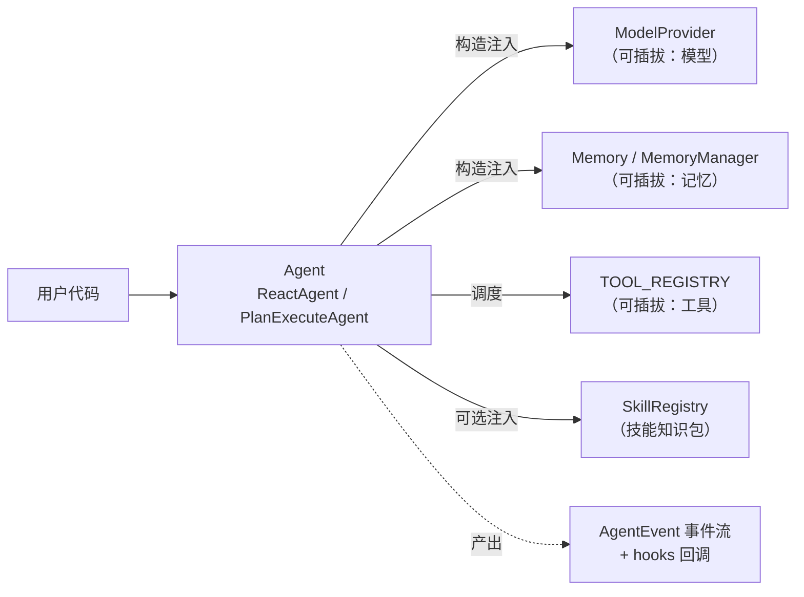

# GearLink 使用教程

> 面向新手的完整教程：从安装到第一个 Agent，再到工具、记忆、技能与进阶扩展。
> 文中所有代码均可直接复制运行，对应的完整示例见文末索引。

## 目录

1. [简介与安装](#1-简介与安装)
2. [快速开始：5 分钟跑通第一个 Agent](#2-快速开始5-分钟跑通第一个-agent)
3. [核心概念](#3-核心概念)
4. [三大调用方式](#4-三大调用方式run--run_stream--run_events)
5. [工具：让 Agent 动手做事](#5-工具让-agent-动手做事)
6. [记忆：短期、长期与会话摘要](#6-记忆短期长期与会话摘要)
7. [技能：给 Agent 装载专业知识包](#7-技能给-agent-装载专业知识包)
8. [进阶：自定义扩展](#8-进阶自定义扩展)
9. [进阶特性：重试、持久化、MCP、可观测性、多 Agent 协作](#9-进阶特性重试持久化mcp可观测性多-agent-协作)
10. [常见问题 FAQ](#10-常见问题-faq)
11. [示例与文档索引](#11-示例与文档索引)

---

## 1. 简介与安装

GearLink 是一个轻量级 Agent 框架，核心只有三样东西：

- **一个 ReAct 循环编排器**（外加规划-执行策略）；
- **三个可插拔维度**：模型（Provider）、记忆（Memory）、工具（Tool）；
- **一个技能扩展**（Skill，渐进式披露的知识包）。

不引入重型框架，全部公共 API 从顶层包 `gearlink` 显式导出。

### 1.1 安装

要求 Python >= 3.10。

**从 PyPI 安装（推荐）**：

```bash
pip install gearlink              # 核心包
# 按需安装可选依赖：
pip install gearlink[anthropic]   # Anthropic Claude 支持
pip install gearlink[mcp]         # MCP 外部工具支持
```

**从源码开发安装**：

```bash
git clone https://github.com/Mzys521/gearlink.git
cd gearlink
pip install -e ".[dev]"          # 含开发依赖（pytest / ruff）
```

### 1.2 配置 API 密钥

GearLink 内置的 `OpenAIProvider` 默认对接 DeepSeek（任何 OpenAI 兼容服务均可）。
复制环境变量模板并填入密钥：

```bash
cp .env.example .env   # Windows: copy .env.example .env
```

`.env` 内容：

```
DEEPSEEK_API_KEY=你的密钥
# 可选：DEEPSEEK_MODEL=deepseek-v4-flash
# 可选：DEEPSEEK_BASE_URL=https://api.deepseek.com
```

> 没有密钥也能学：本教程第 4、8 节的多个示例内置了无网络的 EchoProvider，
> 免密钥即可运行（见 [examples/custom_provider_demo.py](../examples/custom_provider_demo.py)）。

## 2. 快速开始：5 分钟跑通第一个 Agent

```python
from dotenv import load_dotenv

from gearlink import OpenAIProvider, ReactAgent

load_dotenv()  # 从 .env 读取 DEEPSEEK_API_KEY

agent = ReactAgent(provider=OpenAIProvider())
print(agent.run("现在几点了？"))
```

运行后 Agent 会自动完成一个 ReAct 循环：

1. **Reason**：模型判断需要查询时间，请求调用 `get_current_time` 工具；
2. **Act**：框架执行工具并把结果写回对话；
3. **Observe**：模型基于工具结果生成最终答案。

框架内置了 `get_current_time` 工具，无需任何注册代码——你只需要提供模型。

## 3. 核心概念



| 概念 | 对应类型 | 一句话说明 |
|---|---|---|
| Agent | `ReactAgent` / `PlanExecuteAgent` | 编排循环的策略；前者 ReAct，后者先规划后执行 |
| Provider | `ModelProvider` 抽象 / `OpenAIProvider` | 屏蔽具体模型服务的调用细节 |
| Memory | `Memory` 抽象 / `ShortTermMemory` / `LongTermMemory` / `MemoryManager` | 保存对话上下文，每轮重建请求 |
| Tool | `register_tool` / `call_tool` | 注册表 + JSON Schema + 调度器三件套 |
| Skill | `Skill` / `SkillRegistry` / `SkillLoader` | 渐进式披露的 `SKILL.md` 知识包 |
| 事件 | `AgentEvent` 子类 + `HookFn` | 循环每一步都可观察、可干预 |

所有组件都通过**构造参数注入**，没有隐式全局状态：

```python
ReactAgent(provider=..., memory=..., skill_registry=..., hooks=...)
```

## 4. 三大调用方式：`run` / `run_stream` / `run_events`

三种方式共享同一个编排循环（`run_events` 是唯一实现，另两种是它的消费者）。

### 4.1 `run`：一次性拿答案

```python
answer = agent.run("介绍一下你自己")
```

### 4.2 `run_stream`：逐片段流式输出

```python
for delta in agent.run_stream("用一段话介绍 GearLink"):
    print(delta, end="", flush=True)
```

工具调用阶段照常执行并继续循环，最终答案同样流式输出。
若自定义 Provider 未覆写 `chat_stream`，会自动回退到非流式 `chat()`（一次性产出全文）。

### 4.3 `run_events`：完整事件流

每一步都会产出一个事件对象，适合做监控、审计与自定义 UI：

| 事件 | 含义 |
|---|---|
| `StepStartEvent` | 一轮 ReAct 迭代开始 |
| `TextDeltaEvent` | 流式模式下的文本增量 |
| `ModelMessageEvent` | 模型的完整响应（可能含工具调用请求） |
| `ToolCallStartEvent` / `ToolCallEndEvent` | 单个工具执行前/后（含结果与错误信息） |
| `FinalAnswerEvent` | 循环收敛，给出最终答案 |
| `LoopAbortEvent` | 达到最大轮数被中止（携带兜底文案） |
| `PlanGeneratedEvent` / `PlanStepStartEvent` / `PlanStepEndEvent` | `PlanExecuteAgent` 的规划与逐步执行事件 |

```python
for event in agent.run_events("现在几点了？"):
    print(event.seq, event.type)
```

完整可运行版本见 [examples/event_hooks_demo.py](../examples/event_hooks_demo.py)（免密钥）。

### 4.4 规划-执行 Agent

任务较复杂时改用 `PlanExecuteAgent`：先规划（分解步骤清单），再逐步执行
（每步复用 `ReactAgent` 子循环，支持工具），最后整合为最终答案：

```python
from gearlink import OpenAIProvider, PlanExecuteAgent

agent = PlanExecuteAgent(provider=OpenAIProvider(), max_steps=5)
print(agent.run("对比 Python 与 Go 的适用场景并给出选型建议"))
```

规划器输出无法解析时自动退化为单步骤直接执行；步骤数超过 `max_steps` 自动截断。
完整示例见 [examples/plan_execute_demo.py](../examples/plan_execute_demo.py)。

## 5. 工具：让 Agent 动手做事

### 5.1 注册自定义工具

工具实现与其 JSON Schema **同源定义**，通过 `register_tool` 显式登记：

```python
from gearlink import register_tool


def multiply(a: float, b: float) -> float:
    """两数相乘"""
    return a * b


register_tool(
    "multiply",
    multiply,
    {
        "description": "计算两个数的乘积",
        "parameters": {
            "type": "object",
            "properties": {
                "a": {"type": "number", "description": "乘数 a"},
                "b": {"type": "number", "description": "乘数 b"},
            },
            "required": ["a", "b"],
        },
    },
)
```

注册后，之后创建的 `ReactAgent` 每轮都会把该工具的 schema 交给模型，
模型会在需要时自动调用它。

### 5.2 直接调度与错误兜底

`call_tool` 是集中错误兜底的调度器，也可以脱离 Agent 直接使用：

```python
from gearlink import ToolError, ToolNotFoundError, call_tool

call_tool("multiply", {"a": 6, "b": 7})  # -> 42.0

try:
    call_tool("not_registered", {})
except ToolNotFoundError:
    ...  # 未知工具
```

工具执行失败**不会中断** ReAct 循环：错误被包装为文本写回 `role=tool`
消息，交给模型自行处理（可恢复信号设计）。

完整示例见 [examples/custom_tool_demo.py](../examples/custom_tool_demo.py)（免密钥）。

## 6. 记忆：短期、长期与会话摘要

### 6.1 默认行为

`ReactAgent(provider)` 不传 `memory` 时，默认使用
`ShortTermMemory(max_message=20)` 并附加内置系统提示——最近 20 条消息滑窗，
超出从最旧开始移除（也支持按 `max_tokens` 预算裁剪）。

### 6.2 长期记忆：跨会话记住用户

长期记忆基于 chromadb 向量检索。`MemoryManager` 组合短期与长期记忆：
user/assistant 文本消息即时沉淀进长期库，每轮请求前按语义检索 top-k 注入上下文：

```python
import chromadb

from gearlink import LongTermMemory, MemoryManager, OpenAIProvider, ReactAgent, ShortTermMemory

memory = MemoryManager(
    short_term=ShortTermMemory(max_message=20),
    long_term=LongTermMemory(
        vector_db=chromadb.PersistentClient(path=".chroma"),
        collection_name="chat_history",
    ),
    max_context_tokens=4000,  # 可选：上下文 token 预算
)
agent = ReactAgent(provider=OpenAIProvider(), memory=memory, retrieve_every_iteration=True)

print(agent.run("我喜欢喝奶茶，请记住这一点"))
# ……下次会话（同一个 collection）再问：
print(agent.run("我之前说过喜欢什么？"))  # 自动检索长期记忆注入上下文
```

`LongTermMemory` 的可选能力（默认关闭）：

- `recency_weight`：检索排序的时间衰减权重，让新近记忆适度排前；
- `max_entries`：容量上限，超出时淘汰最旧条目；
- `dedupe=True`：写入前按内容 sha256 哈希去重。

### 6.3 会话摘要沉淀

注入 `summarizer`（`Callable[[str], str]`）后，`end_session()` 会把本次会话的
user/assistant 文本拼成 transcript 交给它生成摘要，带 `[会话摘要]` 前缀沉淀进
长期记忆——下次会话检索时即可回忆整段对话的要点：

```python
memory = MemoryManager(
    short_term=ShortTermMemory(max_message=20),
    long_term=long_term,
    summarizer=lambda transcript: summarize_with_llm(transcript),  # 自行实现
)
# ……对话若干轮……
memory.end_session()  # 会话结束：生成摘要沉淀 + 补沉淀剩余消息 + 清空短期
```

完整的多轮对话助手见 [examples/memory_chatbot.py](../examples/memory_chatbot.py)。

> 注意：短期记忆与 `MemoryManager` 的会话状态都在内存中，进程退出即丢失；
> 长期记忆库（chromadb 持久化路径）可跨进程保留。

## 7. 技能：给 Agent 装载专业知识包

**Skill = 一份渐进式披露的专业知识包**：平时只把技能名单（名称 + 简介）放进
系统提示，模型需要时才通过内置的 `load_skill` 工具加载完整指令，节省 token。

### 7.1 编写一个技能

每个技能是一个目录，内含 `SKILL.md`，YAML frontmatter 必含 `name` / `description`：

```markdown
---
name: demo-skill
description: 一个演示技能，用于展示 Skills 模块的基本功能
---

# 示例技能指令

当用户请求使用 demo-skill 时，请执行以下步骤：
1. 确认用户意图。
2. 告知用户当前日期和时间（可以使用 get_current_time 工具获取）。
3. 根据时间返回一句问候语。
```

参考现成示例：[examples/skill_demo/demo-skill/SKILL.md](../examples/skill_demo/demo-skill/SKILL.md)。

### 7.2 发现与注入

```python
from pathlib import Path

import gearlink.tools.load_skill  # 显式导入，触发 load_skill 工具注册
from gearlink import OpenAIProvider, ReactAgent, SkillLoader, SkillRegistry

registry = SkillRegistry()
for skill in SkillLoader.discover_from_directory(Path("examples/skill_demo")):
    registry.register(skill)

agent = ReactAgent(provider=OpenAIProvider(), skill_registry=registry)
print(agent.run("使用 demo-skill 向我问好"))
```

注入后：系统提示自动列出可用技能（L1 元数据）；模型按需调用 `load_skill`
获取完整指令（L2 正文）并遵循执行。技能名校验非法（仅允许字母、数字、连字符）
时抛出 `SkillValidationError`；目录中单个技能解析失败只警告跳过，不影响其余技能。

## 8. 进阶：自定义扩展

### 8.1 自定义 Provider（免密钥可运行）

只需继承 `ModelProvider` 并实现 `chat()`，返回统一的 `ModelResponse`：

```python
from typing import Any

from gearlink import ModelProvider, ModelResponse, ReactAgent


class EchoProvider(ModelProvider):
    def chat(
        self,
        messages: list[dict[str, Any]],
        tools: list[dict[str, Any]] | None = None,
        response_format: dict[str, Any] | None = None,
    ) -> ModelResponse:
        last_user = next((m["content"] for m in reversed(messages) if m.get("role") == "user"), "")
        return ModelResponse(content=f"[EchoProvider] 你说的是：{last_user}")


agent = ReactAgent(provider=EchoProvider())
print(agent.run("你好，GearLink！"))
```

未覆写 `chat_stream()` 时自动回退非流式。完整示例见
[examples/custom_provider_demo.py](../examples/custom_provider_demo.py)。

接入其他 OpenAI 兼容服务（Qwen / Kimi / GLM 等）无需写新类，改 `base_url` 即可：

```python
provider = OpenAIProvider(
    api_key="...",
    base_url="https://dashscope.aliyuncs.com/compatible-mode/v1",
    model="qwen-plus",
)
```

### 8.2 自定义 Memory（免密钥可运行）

继承 `Memory` 实现三个方法即可注入 Agent：

```python
from gearlink import Memory


class DedupWindowMemory(Memory):
    def __init__(self, max_message: int = 10) -> None:
        self.max_message = max_message
        self.messages: list[dict[str, Any]] = []

    def add_message(self, message: dict[str, Any]) -> None:
        if any(m.get("content") == message.get("content") for m in self.messages):
            return  # 内容重复则跳过
        self.messages.append(message)
        if len(self.messages) > self.max_message:
            self.messages = self.messages[-self.max_message :]

    def get_messages(self, limit: int | None = None) -> list[dict[str, Any]]:
        return self.messages if limit is None else self.messages[-limit:]

    def clear(self) -> None:
        self.messages = []


agent = ReactAgent(provider=EchoProvider(), memory=DedupWindowMemory())
```

完整示例见 [examples/custom_memory_demo.py](../examples/custom_memory_demo.py)。

### 8.3 事件钩子：观察与干预

经构造参数 `hooks` 或 `add_hook` 注入回调（on_step 语义）。回调接收每个事件，
返回 `None` 表示只观察，返回事件对象表示替换：

```python
from gearlink import AgentEvent, FinalAnswerEvent


def stamp_hook(event: AgentEvent) -> AgentEvent | None:
    if isinstance(event, FinalAnswerEvent):
        event.content += "（已审核）"
        return event  # 返回替换事件
    return None  # 其余事件只观察


agent.add_hook(stamp_hook)
```

完整示例见 [examples/event_hooks_demo.py](../examples/event_hooks_demo.py)（免密钥）。

### 8.4 日志开关

框架默认静默（不配置任何 handler）。一键开启内部日志：

```python
import logging

from gearlink import disable_logging, enable_logging

enable_logging()  # 输出到 stderr，级别 INFO
enable_logging(logging.DEBUG)  # 或指定更细级别
disable_logging()  # 关闭，恢复静默
```

两个函数均幂等；开启后框架日志统一经开关输出，不再向应用根日志器传播。

### 8.5 token 计数工具

上下文预算裁剪内部使用启发式计数，也对外开放：

```python
from gearlink import count_message_tokens, estimate_tokens

estimate_tokens("这是一段待估算的文本")
count_message_tokens([{"role": "user", "content": "你好"}])
```

### 8.6 数据结构序列化

需要持久化的 dataclass 均提供 `to_dict()` / `from_dict()` 往返方法：
`MemoryEntry`、`ToolCall`、`ModelResponse`、`Session`。

## 9. 进阶特性：重试、持久化、MCP、可观测性、多 Agent 协作

本章介绍 M1 / M2 带来的新能力——全部默认关闭/可选，不影响既有写法。

### 9.1 自动重试与结构化输出

网络抖动、限流等瞬时故障可交给框架自动重试（指数退避；鉴权错误不会重试）：

```python
agent = ReactAgent(provider=OpenAIProvider(), max_retries=3)  # 默认 0 = 不重试
```

需要模型严格输出 JSON 时，直接调用 provider 并传 `response_format`：

```python
provider = OpenAIProvider()
response = provider.chat(
    messages=[{"role": "user", "content": "把“苹果 3 元”提取为 JSON"}],
    response_format={"type": "json_object"},
)
```

### 9.2 会话持久化与断线恢复

`MemoryManager.snapshot()` 导出会话快照（短期记忆全量消息 + 元数据），
JSON 落盘后，重启进程用 `restore()` 无缝继续：

```python
import json

snapshot = memory.snapshot(model="deepseek-chat", metadata={"user_id": "u-1"})
with open("session.json", "w", encoding="utf-8") as f:
    json.dump(snapshot, f, ensure_ascii=False)

# ……进程重启后……
with open("session.json", encoding="utf-8") as f:
    session = memory.restore(json.load(f))  # 短期记忆恢复，继续对话
```

完整演示见 `examples/session_restore_demo.py`（免密钥）。长期记忆本身已持久化，
不参与快照。

### 9.3 更多模型提供者

```python
from gearlink import AnthropicProvider, OllamaProvider

# 本地 Ollama：无需密钥（需先 ollama pull qwen2.5:7b 并启动服务）
agent = ReactAgent(provider=OllamaProvider())

# Anthropic Claude：pip install gearlink[anthropic]，配 ANTHROPIC_API_KEY
agent = ReactAgent(provider=AnthropicProvider())
```

国产模型（Qwen / Kimi / GLM 等）多兼容 OpenAI 接口，直接用 `OpenAIProvider`
换 `base_url` 即可，无需新类。

### 9.4 工具编排增强

```python
from gearlink import build_tool_schema, register_tool

# 懒得手写 schema？从函数签名 + docstring 自动生成：
schema = build_tool_schema(add)  # add 见第 5 章
register_tool("add", add, schema)

# 只允许 Agent 使用部分工具，或并行执行多个工具调用：
agent = ReactAgent(provider=provider, tools=["get_current_time"], parallel_tool_calls=True)
```

### 9.5 MCP 外部工具

`pip install gearlink[mcp]` 后，`McpClient` 把外部 MCP 服务器的工具映射进
本地注册表（命名为 `mcp_<server>_<tool>`），Agent 无感知直接调用：

```python
from gearlink import McpClient

client = McpClient("external", session)  # session: 已 initialize 的 mcp.ClientSession
client.register_tools()
# ……正常使用 ReactAgent……
client.unregister_tools()  # 会话结束注销（幂等）
```

完整连接流程（stdio 传输）见 `examples/mcp_client_demo.py`。

### 9.6 可观测性：用量、事件落盘与成本

每次模型调用的 token 用量经 `ModelMessageEvent.usage`（`TokenUsage`）透传，
事件流经 `JsonlEventSink` 逐条落盘为 JSONL，可离线回放；`UsageTracker`
按标签聚合用量并估算成本：

```python
from gearlink import JsonlEventSink, UsageTracker, jsonl_hook, load_jsonl_events

with JsonlEventSink("events.jsonl") as sink:
    agent.add_hook(jsonl_hook(sink))  # 每个事件逐条落盘（含 seq / timestamp）
    agent.run("你好")

for event in load_jsonl_events("events.jsonl"):  # 离线回放
    if event["type"] == "model_message":
        print(event["usage"])  # {"input_tokens": ..., "output_tokens": ...}
```

```python
from gearlink import TokenUsage, UsageTracker

tracker = UsageTracker()
for event in load_jsonl_events("events.jsonl"):
    if event["type"] == "model_message" and event["usage"]:
        u = event["usage"]
        tracker.add(TokenUsage(u["input_tokens"], u["output_tokens"]), label="deepseek-chat")
print(tracker.records)  # 按标签聚合的调用次数与 token 用量
print(tracker.total())  # 全部标签的用量总和
print(tracker.estimate_cost({"deepseek-chat": (0.002, 0.008)}))  # 单价为每千 token
```

实时采集也可直接挂 hook：`tracker.add(getattr(event, "usage", None), label=...)`。

完整演示见 `examples/observability_demo.py`（免密钥）。

### 9.7 记忆深化：上下文压缩、用户画像与检索质量

长对话与检索质量的进阶能力（均默认关闭，向后兼容）：

```python
from gearlink import LongTermMemory, MemoryManager, ShortTermMemory

memory = MemoryManager(
    short_term=ShortTermMemory(max_message=50),
    max_context_tokens=8000,
    summarizer=my_summarizer,  # Callable[[str], str]
    compress_context=True,  # 超阈值时把最旧一段压缩为 [上下文摘要]
    profile_hook=my_profile_hook,  # end_session 时沉淀用户画像
)
```

- `compress_context`：须与 `summarizer` / `max_context_tokens` 三者齐备才生效；
  短期记忆超出阈值时把最旧一段（保留最新 2 条）动态压缩为 `[上下文摘要]`
  system 消息写回头部，既有摘要递进纳入新内容；压缩失败不中断（静态裁剪兜底）；
- `profile_hook`：`Callable[[新消息, 当前画像], 新画像或 None]`，`end_session`
  时调用（异常保持原画像）；非 None 时更新画像，后续 `build_context` 以
  `[用户画像]` system 消息首位注入。

检索质量两项（`LongTermMemory` 构造参数）：

```python
long_term = LongTermMemory(
    vector_db=chromadb.PersistentClient(path=".chroma"),
    collection_name="chat_history",
    relevance_threshold=1.2,  # 过滤低相关检索结果（distance 阈值）
    mmr_lambda=0.7,  # MMR 去冗余，避免 top-k 全是重复语义
)
```

- `relevance_threshold`：distance 大于阈值的条目直接丢弃；
- `mmr_lambda`：0~1，越大越偏相关度、越小越偏多样性，1.0 退化纯相关度排序。

存储后端经 `VectorStore` 协议抽象：默认 `ChromaVectorStore`（行为不变），
也可实现协议（`add` / `get` / `query` / `delete` 四方法）后
`LongTermMemory(store=自定义后端)` 注入内存/文件/远程向量库。

完整演示见 `examples/memory_advanced_demo.py`（免密钥）。

### 9.8 多 Agent 协作（Orchestrator）

多角色分工用 `Orchestrator`：主管 Agent 把任务拆分为子任务并派给登记的
工人（各配独立工具/记忆），各工人完成后由主管汇总为最终答案：

```python
from gearlink import Orchestrator, OpenAIProvider, ReactAgent

orchestrator = Orchestrator(
    supervisor=ReactAgent(provider=OpenAIProvider()),
    workers={
        "researcher": ReactAgent(provider=OpenAIProvider(), tools=["search"]),
        "writer": ReactAgent(provider=OpenAIProvider(), tools=[]),
    },
    parallel=False,  # True 时各工人并行执行（事件按序产出）
)
print(orchestrator.run("调研并撰写一份产品介绍"))
```

协作过程经事件流暴露：`TeamPlanGeneratedEvent`（分派清单）→
`AgentHandoffEvent`（派单）→ 工人事件 → `SubtaskEndEvent`；分派输出无法
解析时退化为把原任务派给全部工人。与 `PlanExecuteAgent` 的分工：前者是
**多个独立 Agent** 各干各的，后者是**单模型**按步骤串行执行。

完整演示见 `examples/orchestrator_demo.py`（免密钥）。

## 10. 常见问题 FAQ

**Q1：运行时报 `ValueError: 缺少 API key`？**
未设置 `DEEPSEEK_API_KEY`。创建 `.env`（参考 `.env.example`）并在脚本开头
`load_dotenv()`，或直接设置同名环境变量。想先不配密钥体验，请运行标注
「免密钥」的示例（见 README 示例清单）。

**Q2：工具执行失败了，Agent 会崩吗？**
不会。工具失败是可恢复信号：错误文本写回 `role=tool` 消息交给模型处理，
循环继续。只有模型服务本身的故障（`ProviderError`，如网络/鉴权/限流）
才会向上抛出；瞬时故障可配 `max_retries` 交给框架自动重试（见 §9.1）。

**Q3：Agent 回复「已达到最大推理轮数」？**
ReAct 循环默认最多 10 轮（`MAX_ITERATIONS` 兜底），通常是工具设计让模型
反复调用无法收敛。检查工具 schema 描述是否清晰，或拆分任务。

**Q4：`PlanExecuteAgent`、`Orchestrator` 和 `ReactAgent` 怎么选？**
单轮任务（问答、一次工具调用）用 `ReactAgent`；需要显式分解为多步骤的复杂
任务用 `PlanExecuteAgent`（单模型串行）；需要多个角色各自带工具/记忆分工
协作用 `Orchestrator`（见 §9.8）。前两者内部均复用 `ReactAgent` 子循环与工具。

**Q5：长期记忆检索不到刚说过的内容？**
短期窗口内的消息不会重复注入（去重逻辑）；跨会话内容需确认两次运行使用
同一个 chromadb 持久化路径与 `collection_name`。

**Q6：为什么导入 `gearlink.tools.load_skill` 看起来没用到？**
这是显式导入触发 `load_skill` 工具注册（注册表禁止运行时隐式扫描）。
使用技能时必须保留这一行。

**Q7：如何看框架内部发生了什么？**
`enable_logging(logging.DEBUG)` 开启内部日志；或用 `run_events` /
`add_hook` 观察每一步事件；需要离线审计时用 `JsonlEventSink` 落盘回放
（见 §9.6）。

**Q8：`compress_context` 配了但没生效？**
三者齐备才启用：`compress_context=True` + `summarizer` + `max_context_tokens`，
且短期记忆需超出压缩阈值（`max_context_tokens` 的一定比例）才会触发。

## 11. 示例与文档索引

### 示例（examples/）

| 文件 | 主题 | 免密钥 |
|---|---|---|
| [custom_provider_demo.py](../examples/custom_provider_demo.py) | 自定义 `ModelProvider` | 是 |
| [custom_memory_demo.py](../examples/custom_memory_demo.py) | 自定义 `Memory` 注入 | 是 |
| [event_hooks_demo.py](../examples/event_hooks_demo.py) | 事件流 + hooks 观察/替换 | 是 |
| [custom_tool_demo.py](../examples/custom_tool_demo.py) | 注册/调度自定义工具 | 是（Agent 联动需 key） |
| [session_restore_demo.py](../examples/session_restore_demo.py) | 会话 `snapshot` / `restore` 断线恢复 | 是 |
| [ollama_local_demo.py](../examples/ollama_local_demo.py) | `OllamaProvider` 本地模型 | 无需 key（需本地 Ollama 服务） |
| [anthropic_demo.py](../examples/anthropic_demo.py) | `AnthropicProvider` 接入 Claude | 否（需 `gearlink[anthropic]`） |
| [mcp_client_demo.py](../examples/mcp_client_demo.py) | `McpClient` 消费外部 MCP 工具 | 否（需 `gearlink[mcp]`） |
| [observability_demo.py](../examples/observability_demo.py) | usage 透传 + JSONL 落盘回放 + 成本估算 | 是 |
| [memory_advanced_demo.py](../examples/memory_advanced_demo.py) | 上下文压缩 / 用户画像 / 检索阈值与 MMR | 是 |
| [orchestrator_demo.py](../examples/orchestrator_demo.py) | `Orchestrator` 主管-工人多 Agent 协作 | 是 |
| [memory_chatbot.py](../examples/memory_chatbot.py) | 短期+长期记忆+会话摘要对话助手 | 否 |
| [streaming_demo.py](../examples/streaming_demo.py) | `run_stream` 流式输出（含工具） | 否 |
| [plan_execute_demo.py](../examples/plan_execute_demo.py) | 规划-执行 + 事件回调 | 否 |
| [skill_demo/](../examples/skill_demo/) | 技能目录结构 | — |

### 文档（docs/）

- [架构设计](架构设计.md)：分层架构、运行时数据流与四类扩展点契约；
- [接口文档](接口文档.md)：每个公共 API 的作用与用法说明；
- [开发规范](开发规范.md)：开发流程、代码规范与 API 设计原则（贡献前必读）；
- [开发方向](开发方向.md)：P0~P3 路线图。
