# GearLink 开发方向

> 本文档基于对 `gearlink/` 核心包的完整代码审查，盘点当前能力现状与短板，
> 给出分优先级（P0 ~ P3）的发展方向与里程碑建议，作为后续迭代规划的依据。
> 所有方向均须遵循既有规范：依赖倒置（`core/` 不 import `providers/` / `tools/` / `mcp/` 具体实现）、
> 公共 API 只增不改、构造参数注入、测试必须 mock 外部服务（`docs/开发规范.md` §1 / §10）。

> **当前进度（截至 0.4.0，2026-08-15）**：P0 工程化门槛、P1 可插拔深化、P2 生产可用
> 三大里程碑（M0 / M1 / M2）均已落地（详见 `CHANGELOG.md` 与 `TODO.md`）。
> 当前后续演进集中在 **P3**：在既有的「安全治理 / 技能生态 / CLI 服务化」之外，
> 补充「架构治理 / 鲁棒性与确定性 / 可观测性与异常深化 / 异步并发与 DX」四类
> 架构债务与开发者体验方向（本次代码审查新增，见 §1.3 与 §6.4–6.7）。
> 其中 §6.4 架构治理（去全局单例 + 统一记忆契约）与 §6.5 前两项
> （Provider 超时 + 结构化输出强制）已完成；0.4.0 已增加依赖编排与模型自主 DAG 编排。
> 本文档保留 P0~P2 的设计留档以备追溯，各章节均标注完成状态。

## 1. 现状盘点

### 1.1 已落地能力

| 维度 | 能力 | 位置 | 状态 |
|---|---|---|---|
| Agent 编排 | `Agent` 抽象统一 `run` / `run_stream` / `run_events` / `add_hook` 契约 | `core/agent.py` | ✅ |
| Agent 编排 | `ReactAgent` ReAct 循环（工具失败可恢复、`MAX_ITERATIONS` 兜底、工具结果 token 截断、`retrieve_every_iteration`） | `core/agent.py` | ✅ |
| Agent 编排 | `PlanExecuteAgent` 规划-执行（规划解析失败退化为单步骤、`max_steps` 截断、多步整合） | `core/agent.py` | ✅ |
| Agent 编排 | `Orchestrator` 主管-工人多 Agent 协作（分派解析失败兜底、`parallel=True` 并行） | `core/orchestrator.py` | ✅ |
| 事件流 | `AgentEvent` 全事件体系（含 Plan / Team / Handoff / Subtask）+ `HookFn` on_step 回调 | `core/events.py` | ✅ |
| 记忆 | `ShortTermMemory` 滑窗 + `max_tokens` 预算 | `core/memory.py` | ✅ |
| 记忆 | `LongTermMemory` chromadb 向量检索 + 时间衰减 + 容量淘汰 + 去重 + 阈值/MMR + `VectorStore` 协议抽象 | `core/memory.py` | ✅ |
| 记忆 | `MemoryManager` 组合器（检索注入、上下文预算、会话摘要沉淀、system 预算、`compress_context` / `profile_hook`） | `core/memory.py` | ✅ |
| 记忆 | `Session` + `snapshot()` / `restore()` 会话持久化与断线恢复 | `core/memory.py` | ✅ |
| 模型 | `ModelProvider` 抽象（`chat` / `chat_stream` 默认回退非流式、`response_format` 结构化输出） | `providers/base.py` | ✅ |
| 模型 | `OpenAIProvider`（OpenAI 兼容接口，默认 DeepSeek，透传 usage / response_format） | `providers/openai_provider.py` | ✅ |
| 模型 | `OllamaProvider`（本地，无需密钥）/ `AnthropicProvider`（Messages API 归一化，依赖可选） | `providers/` | ✅ |
| 工具 | 「注册表 + JSON Schema + 调度器」三件套 + `register_tool` 显式注册 + `build_tool_schema` 自动生成 + 白名单 / 并行执行 | `core/tool.py` | ✅ |
| 技能 | `Skill` / `SkillRegistry` / `SkillLoader` 渐进式披露 + `load_skill` 工具 | `skills/base.py`、`tools/load_skill.py` | ✅ |
| MCP | `McpClient` 把外部 MCP 服务器工具映射进注册表（`mcp_<server>_<tool>`，依赖可选） | `mcp/client.py` | ✅ |
| 可观测性 | `TokenUsage` 用量透传 + `JsonlEventSink` 事件落盘回放 + `UsageTracker` 成本估算 | `providers/base.py`、`core/events.py`、`utils/usage.py` | ✅ |
| Provider 重试 | `ProviderError.retryable` + `ReactAgent(max_retries=...)` 指数退避（鉴权错误不重试） | `core/agent.py` | ✅ |
| 日志 | `enable_logging` / `disable_logging` 全局开关（默认静默，幂等） | `utils/logging.py` | ✅ |
| 测试 | 外部服务全部 mock；CI 执行格式、lint、完整测试，并强制 `gearlink/core` 覆盖率不低于 80% | `tests/`、`pyproject.toml` | ✅ |
| 工程化 | GitHub Actions CI（格式化检查 + lint + 测试 + core ≥ 80% 门禁 + gitleaks 扫描）+ MIT LICENSE | `.github/workflows/ci.yml` | ✅ |

### 1.2 历史短板（已全部解决）

下表记录 0.1.0 发布前识别的关键短板及其解决归属；保留以备追溯，不再视为待办。

| # | 短板 | 解决方案 | 完成里程碑 |
|---|---|---|---|
| 1 | CI 流水线、core 覆盖率门槛、LICENSE、历史密钥审查缺失 | GitHub Actions CI + `pytest-cov` 门禁 + MIT LICENSE + gitleaks 扫描 | M0 ✅ |
| 2 | 公共 API 可运行示例未补齐 | `examples/` 覆盖全部公共 API 分类（15 个示例） | M0 ✅ |
| 3 | 长期记忆 embedding 不可配置 | `EmbeddingFn` 类型契约 + `LongTermMemory(embedding_function=...)` 注入 | M1 ✅ |
| 4 | 仅一个 `ModelProvider` 实现 | 新增 `OllamaProvider` / `AnthropicProvider` | M1 ✅ |
| 5 | `ProviderError` 无内置重试/退避 | `ProviderError.retryable` + `ReactAgent(max_retries=...)` 指数退避 | M1 ✅ |
| 6 | 工具集全局单一、串行执行、JSON Schema 手写 | `tools` 白名单 + `parallel_tool_calls` + `build_tool_schema` 自动生成 | M1 ✅ |
| 7 | 无会话持久化/恢复 | `Session` + `MemoryManager.snapshot()` / `restore()` | M1 ✅ |
| 8 | 未接入 MCP 生态 | `gearlink/mcp/` `McpClient`（依赖可选） | M1 ✅ |
| 9 | 无 token/成本统计、事件流不可落盘回放 | `TokenUsage` + `JsonlEventSink` / `load_jsonl_events` + `UsageTracker` | M2 ✅ |
| 10 | 记忆仅两层、上下文只静态裁剪、无用户画像 | `compress_context` 动态压缩 + `profile_hook` 用户画像 + `relevance_threshold` / `mmr_lambda` 检索质量 | M2 ✅ |
| 11 | 无多 Agent 协作/任务分发 | 编排层 `Orchestrator`（主管-工人，可并行）+ 协作事件 | M2 ✅ |
| 12 | 无提示注入防护、工具权限审批、敏感信息脱敏 | （未排期，列入 P3 长期演进） | P3 ⏳ |
| 13 | 技能生态单薄、无 CLI/服务化 | （未排期，列入 P3 长期演进） | P3 ⏳ |

### 1.3 待优化短板（本次代码审查新增）

下表记录 0.1.0 之后识别出的架构债务与开发者体验（DX）短板，按优先级排序，
归入 §6.4–6.7 后续演进方向（未排期，遵循「纯新增、默认值等价现状、公共 API 只增不改」原则）。

| # | 短板 | 影响 | 建议方向 | 优先级 | 状态 |
|---|---|---|---|---|---|
| 1 | 工具/技能注册表为进程级全局单例 | 多 Agent 无法隔离工具集/技能集，并发不安全 | 注册表实例化注入 Agent（§6.4） | 高 | ✅ |
| 2 | 记忆两套契约，`ReactAgent` 用 `isinstance(MemoryManager)` 特判 | 第三方「带检索注入」记忆无法不改 core 接入 | 统一记忆/上下文构建协议（§6.4） | 高 | ✅ |
| 3 | Provider 无超时；OpenAI SDK 默认重试与框架 `max_retries` 双重重试 | 网络挂起永久阻塞、重试行为难预期 | `timeout` 参数 + 统一重试语义（§6.5） | 高 | ✅ |
| 4 | 规划/分派 JSON 裸解析，未用 `response_format` 强制 | 模型输出裹说明文字即静默降级 | `response_format=json_object` + JSON 修复/校验（§6.5） | 高 | ✅ |
| 5 | token 计数启发式不可替换，工具结果按 `*4` 字符截断 | 预算与截断误差大（中文/代码/emoji） | `TokenCounter` 协议 + 修正截断（§6.5） | 中 | ⏳ |
| 6 | `build_tool_schema` 丢弃可空信息、无法推导参数描述 | `Optional[X]` 不生成 nullable；存在 `_nullable` 死代码 | 支持 nullable 与参数描述（§6.5） | 中 | ⏳ |
| 7 | `ProviderError` 仅 `retryable` 布尔 | 消费方无法区分限流/鉴权/服务端 | 派生子类（向后兼容）（§6.6） | 中 | ⏳ |
| 8 | 事件流拍平+重编号，丢失子循环父子关系 | 难定位工具调用属于哪个子任务 | 事件 `trace_id` / `parent_seq`（§6.6） | 中 | ⏳ |
| 9 | 无版本号 / `py.typed` / 类型检查 CI | 公共 API 稳定性与类型保障不足 | `__version__` + `py.typed` + mypy（§6.6） | 低 | ⏳ |
| 10 | 全同步 API，并行用线程池（GIL 受限），无取消语义 | 高并发/长任务吞吐与可控性不足 | 异步变体 + 取消令牌（§6.7） | 中 | ⏳ |
| 11 | Provider 配置硬编码 DeepSeek 语义、无统一配置对象 | 配置散落、换厂商体验割裂 | `GearLinkConfig` 统一 env 读取（§6.7） | 低 | ⏳ |

## 2. 发展方向总览

优先级定义：

- **P0 开源发布门槛**：✅ 已完成（M0）。0.1.x 的发布前提。
- **P1 可插拔深化**：✅ 已完成（M1）。兑现「三个可插拔维度」框架承诺。
- **P2 生产可用**：✅ 已完成（M2）。让框架可观测、可恢复、可扩展。
- **P3 生态、治理与架构演进**：⏳ 未排期。安全治理、产品化，以及架构债务与开发者体验（DX）优化，长期演进方向。

```mermaid
flowchart LR
    subgraph P0[P0 开源门槛 ✅]
        CI[CI 流水线]
        COV[覆盖率门槛]
        LIC[LICENSE / 密钥审查]
        EXA[示例补齐]
    end
    subgraph P1[P1 可插拔深化 ✅]
        EMB[Embedding 抽象]
        PRO[Provider 生态]
        RET[Provider 重试]
        TOOL[工具编排增强]
        SESS[会话持久化]
        MCP[MCP 接入]
    end
    subgraph P2[P2 生产可用 ✅]
        OBS[可观测性]
        MEM2[记忆深化]
        MULTI[多 Agent 协作]
    end
    subgraph P3[P3 生态、治理与架构演进 ⏳]
        SEC[安全治理]
        SKILL2[技能生态]
        PROD[CLI / 服务化]
        ARCH[架构治理]
        ROBUST[鲁棒性 / 确定性]
        OBS2[可观测性 / 异常深化]
        ASYNC[异步 / 并发 / DX]
    end
    P0 --> P1 --> P2 --> P3
```

## 3. P0：工程化与开源发布门槛 ✅ 已完成

目标：达成 `docs/开发规范.md` §6/§8/§9 的全部要求，使项目可对外发布。

| 事项 | 落地情况 |
|---|---|
| CI 流水线 | GitHub Actions：`ruff format --check` + `ruff check` + `pytest --cov` + core ≥ 80% 门禁；Python 3.10/3.12 矩阵；PR 必须通过 |
| 覆盖率 | `pytest-cov` 接入，`[tool.coverage.run] source = ["gearlink/core"]`、`fail_under = 80`；当前实测 95.82% |
| LICENSE | 已采用 MIT，根目录 `LICENSE` |
| 历史密钥审查 | CI 接入 `gitleaks/gitleaks-action@v2`（全历史扫描）；旧提交硬编码密钥须发布前轮换（见 `TODO.md` 最后一项） |
| 示例补齐 | `examples/` 覆盖全部公共 API 分类（15 个示例，含 8 个免密钥可运行） |
| dataclass 序列化 | `MemoryEntry` / `ToolCall` / `ModelResponse` / `TokenUsage` 均提供 `to_dict()` / `from_dict()`，含往返一致性测试 |

**验收**：`TODO.md` 全部勾选；`examples/` 覆盖全部公共 API 分类；CI 绿。✅

## 4. P1：可插拔深化 ✅ 已完成（0.2.x）

### 4.1 Embedding 抽象（记忆可插拔的最后一环）✅

- `LongTermMemory` 新增可选构造参数 `embedding_function`；
- `core/` 只定义 `EmbeddingFn = Callable[[list[str]], list[list[float]]]` 类型契约，
  具体实现由应用层注入，不破坏依赖倒置；
- `add_message` 与 `get_relevant_messages` 两条路径统一走注入的 embedding。

**验收**：默认不注入时行为与现状完全一致；注入后检索结果基于自定义 embedding。✅

### 4.2 Provider 生态 ✅

- `AnthropicProvider`：适配 Anthropic Messages API（请求侧 system 提取 / tool_use / tool_result 转换，响应侧 text / tool_use 块归一化）；
- `OllamaProvider`：本地模型，无需密钥（继承 `OpenAIProvider` 复用 `/v1` 兼容端点）；
- 国产模型（Qwen / Kimi / GLM）兼容 OpenAI 接口，作为 `OpenAIProvider` 的 `base_url` 用法沉淀到 README。

**验收**：每个新 provider 有 `tests/` 用例（mock 外部服务）与 `examples/` 示例。✅

### 4.3 Provider 重试与结构化输出 ✅

- `ReactAgent` 新增可选参数 `max_retries: int = 0`（默认 0 = 现状，兼容）；重试仅针对
  `retryable=True` 的 `ProviderError`（网络/限流），鉴权错误不重试；指数退避；
- `ModelProvider.chat` / `chat_stream` 增加可选 `response_format` 参数，`OpenAIProvider` 透传。

**验收**：默认参数下现有测试零改动；注入 `max_retries` 后 Fake 失败 N 次可恢复。✅

### 4.4 工具编排增强 ✅

- **工具白名单**：`ReactAgent(tools=...)` 按名过滤本轮可用 schema；
- **并行执行**：`parallel_tool_calls=True` 时相互独立的工具调用改用线程池并行
  （事件产出顺序与结果写回顺序不变）；
- **schema 自动生成**：`build_tool_schema` 从函数签名 + docstring 推导 JSON Schema（纯新增，不替换手写路径）。

**验收**：默认行为与现状一致；白名单/并行行为符合预期。✅

### 4.5 会话持久化与恢复 ✅

- 新增 `Session` dataclass（会话 = 记忆快照 + 元数据）；
- `MemoryManager` 增加 `snapshot() -> dict` / `restore(dict)` 一对方法，不改既有构造签名；
- `examples/session_restore_demo.py` 提供「断线恢复」示例。

**验收**：`snapshot → restore` 往返后 `build_context` 输出与中断前一致。✅

### 4.6 MCP 接入 ✅

- 新增 `gearlink/mcp/`：`McpClient`（客户端优先）把远端 MCP 工具清单映射进
  `TOOL_REGISTRY`（命名 `mcp_<server>_<tool>`），调用时转发参数并归一化结果；
- `core/` 无感知，复用现有调度器与 ReAct 循环；
- 依赖 `mcp` 作为 optional dependency（`pip install gearlink[mcp]`），不进入核心依赖。

**验收**：`examples/mcp_client_demo.py` 可调用外部 MCP 工具完成 ReAct 任务；未安装 `mcp` 时核心包照常导入。✅

## 5. P2：生产可用 ✅ 已完成（0.3.x）

### 5.1 可观测性 ✅

- `ModelResponse` 增加可选 `usage: TokenUsage | None` 字段，`OpenAIProvider` 透传；
- `ModelMessageEvent.usage` 事件透传；
- 事件流落盘：`JsonlEventSink` / `jsonl_hook` / `load_jsonl_events` 把事件逐条序列化为 JSONL（含 `seq` / `timestamp`），支持离线回放；
- `UsageTracker` / `UsageRecord` 按标签聚合用量并估算成本；
- 可选接入 OpenTelemetry span 追踪：未排期，留作后续增强。

### 5.2 记忆深化 ✅

- **上下文摘要压缩**：`MemoryManager(compress_context=True)`，与 `summarizer` / `max_context_tokens`
  三者齐备时生效，短期记忆超出阈值把最旧一段动态压缩为 `[上下文摘要]` system 消息写回头部；
- **用户画像**：`profile_hook: ProfileHookFn`，`end_session` 时沉淀用户画像，`build_context` 优先以
  `[用户画像]` system 消息首位注入；
- **检索质量**：`LongTermMemory(relevance_threshold=...)` distance 阈值过滤 +
  `mmr_lambda=...` MMR 去冗余重排；
- **存储后端抽象**：`VectorStore` 协议（`add` / `get` / `query` / `delete`），默认 `ChromaVectorStore`
  包装 chromadb（行为不变），可注入自定义后端。

### 5.3 多 Agent 协作 ✅

- `Agent` 保持单输入/单输出契约不变（接口冻结），新增编排层 `Orchestrator(Agent)`（纯新增）：
  - 主管-工人类：主管 Agent 规划任务并分发给多个子 `ReactAgent`（各配独立工具/技能/记忆），汇总结果；
  - `parallel=True` 时工人并行执行（事件按序产出）；
  - 经现有事件流 + hooks 暴露协作过程（`TeamPlanGeneratedEvent` / `AgentHandoffEvent` / `SubtaskEndEvent`，纯新增事件类型）。
- 与 `PlanExecuteAgent` 的关系：`PlanExecuteAgent` 是单模型串行步骤，`Orchestrator` 是多角色并行分工，二者互补。

## 6. P3：生态与治理（长期演进，未排期）

> 以下为后续演进方向，尚未实现。所有方向仍须遵循「纯新增、默认值等价现状、不破坏公共 API」原则。

### 6.1 安全治理

- **提示注入防护**：对注入上下文的外部内容（检索记忆、工具结果）做可疑指令检测与标记；
- **工具权限审批**：`register_tool` 增加危险等级元数据，`ReactAgent` 对高危工具支持
  human-in-the-loop（事件流产出审批请求事件，等待外部确认后放行）；
- **敏感信息脱敏**：日志（`utils/logging.py` 的预览逻辑）与工具结果落盘前对密钥/PII 掩码。

### 6.2 技能生态

- 技能分发：定义 `SKILL.md` 的打包/版本约定，支持从本地目录与（远期）远程仓库发现；
- 技能执行钩子：`Skill` 增加可选 `before/after` 校验或依赖声明（不破坏现有数据契约）。

### 6.3 CLI 与服务化

- `gearlink` CLI：交互式对话（复用 `examples/memory_chatbot.py` 能力）、`--skill-dir` / `--tool` 装配；
- HTTP 服务（FastAPI）：会话管理 + `run_events` 的 SSE 流式转发；可选暴露 MCP 服务端。

### 6.4 架构治理与依赖注入 ✅ 已完成

- **工具/技能注册表去全局单例** ✅：`TOOL_REGISTRY` / `TOOL_SCHEMAS` / `_skill_registry` 由模块级全局
  改为可实例化的 `ToolRegistry` 注入 `ReactAgent`（保留模块级默认实例以兼容现状）；
  `load_skill` 经 `contextvars` 上下文解析所属 Agent 的技能注册表，使同一进程内多个 Agent 可持有独立
  工具集与技能集，并消除 `register_tool` 无锁写全局的并发隐患；
- **统一记忆/上下文契约** ✅：抽象 `ContextBuilder` 协议（含 `build_context(query)`），
  `Memory` 基类新增 `build_context` 默认实现（返回 `get_messages()`），并移除 `ReactAgent._build_messages`
  中对 `MemoryManager` 的 `isinstance` 特判，让第三方记忆可无侵入地提供「检索注入」能力。

### 6.5 鲁棒性与确定性（部分完成）

- **Provider 超时与重试语义统一** ✅：`OpenAIProvider` / `OllamaProvider` 增加 `timeout` 参数，
  并关闭 OpenAI SDK 默认重试（`max_retries=0`），避免与框架 `max_retries` 双重重试；
- **结构化输出强制 + JSON 加固** ✅：规划/分派调用传 `response_format={"type": "json_object"}`，
  新增 `_extract_json` 辅助函数从含 markdown 围栏或说明文字的文本中提取 JSON，加固解析容错；
- **token 计数可注入** ⏳：定义 `TokenCounter` 协议（默认沿用启发式），支持注入 `tiktoken` 等精确实现；
  修正工具结果按 `MAX_TOOL_RESULT_TOKENS * 4` 字符反推的截断误差；
- **`build_tool_schema` 完善** ⏳：`Optional[X]` 生成 nullable（`anyOf` / 类型数组），支持参数级描述
  （`typing.Annotated` 或显式描述字典），消除 `_nullable` 死代码。

### 6.6 可观测性与异常深化

- **`ProviderError` 子类化**：派生 `ProviderRateLimitError` / `ProviderAuthError` /
  `ProviderServerError` 等（向后兼容 `retryable`），让消费方按类型处理而非 if 分支；
- **事件 trace 结构**：`AgentEvent` 增加可选 `trace_id` / `parent_seq`（或 span 关联），在
  `Orchestrator` / `PlanExecuteAgent` 转发子循环事件时保留父子关系，便于端到端定位；远期可选 OTLP 导出；
- **版本与类型治理**：提供 `__version__`、`py.typed` 标记与 mypy/pyright CI 门禁，强化公共 API 稳定性承诺。

### 6.7 异步、并发与开发者体验

- **异步 API**：新增 `arun` / `arun_stream` / `arun_events` 与 `ModelProvider.chat_async`，`Orchestrator` /
  `parallel_tool_calls` 提供 asyncio 变体（替代 GIL 受限的线程池），并支持取消令牌与工具执行超时；
- **统一配置对象**：新增 `GearLinkConfig` 集中管理 env 读取（`DEEPSEEK_*` / `OLLAMA_*` / `ANTHROPIC_*` 等），
  去除各 Provider 内的硬编码默认值语义泄漏，换厂商只需改配置；
- **声明式装配与 CLI**：支持 YAML/JSON 描述 agent 团队并 `Agent.from_config(...)` 装配，配合 §6.3 的 CLI
  降低「多 Agent 编排」的入门门槛。

### 6.8 依赖编排 ✅

- **工人间依赖**：新增 `DependentOrchestrator`（`Orchestrator` 纯新增子类，现有行为不变），
  构造时编程式声明 `dependencies`（worker 名 → 其依赖的上游 worker 名列表）；
- **拓扑分层调度**：执行按 worker 级依赖做 Kahn 拓扑分层，层内可并行（`parallel=True`）、
  层间串行，事件产出顺序仍按分派清单确定性排序、`seq` 全局递增；
- **上游结果注入**：下游任务文本自动追加 `[上游结果]` 报告段落；上游未收敛（兜底文案）
  / 循环中止（reason）仍注入，不中断编排；构造时校验未登记引用与依赖环（抛 `GearLinkError`）；
- 占位符替换（`{{result:worker}}`）、主管自动声明依赖等留作后续演进方向。

### 6.9 模型自主编排 ✅

- **DAG 计划**：新增 `AutonomousOrchestrator`（`Orchestrator` 纯新增子类，现有行为不变），
  主管模型每次请求自主产出有向无环图计划（`{"nodes": [{"id", "worker", "task"}],
  "edges": [{"from", "to"}]}`，节点为子任务、边为数据依赖），自主决定拆分、指派与
  串/并行策略；兼容旧分派数组格式（按序解释为串行链）；
- **拓扑分层混合串并行**：计划校验（未登记工人 / 缺失引用 / 自环 / 环）通过后编译为
  节点级 Kahn 拓扑分层，层内并行（`parallel=True` 默认）、层间串行，同一工人多节点
  按声明顺序串行；事件产出顺序确定性、`seq` 全局递增；
- **并行任务消息同步**：层屏障保证下游开始前其全部直接上游已完成；下游任务执行前按
  依赖边聚合直接上游结果，按上游工人名分组以 `[上游结果]` 报告段落注入；
- **错误处理与兜底**：计划解析失败 / 引用未登记工人 / 缺失依赖 / 成环时记录日志并降级
  为全员兜底分派；事件新增可选字段（`graph` / `parallel_groups` / `layer` / `upstream`，
  默认 `None`）保持向后兼容；
- 主管多轮重规划、跨请求计划复用等留作后续演进方向。

## 7. 里程碑

| 里程碑 | 版本 | 范围 | 状态 | 验收标准 |
|---|---|---|---|---|
| M0 | 0.1.x | P0 全部 | ✅ 已完成 | `TODO.md` 清空；CI 绿；示例覆盖全部公共 API 分类 |
| M1 | 0.2.x | P1 全部 | ✅ 已完成 | 四类扩展点各 ≥ 2 个实现；核心接口零破坏性变更；新增参数保持默认行为 |
| M2 | 0.3.x | P2 全部 | ✅ 已完成 | 会话可持久化恢复；事件可落盘回放；多 Agent 示例可运行；`ModelResponse.usage` 生效 |
| M3 | 0.4.0 | 依赖编排与自主编排 | ✅ 已完成 | 静态 worker 依赖与模型自主 DAG 均支持拓扑分层、上游注入和确定性事件顺序 |
| M4 | 0.3.x+ | P3 继续 | ⏳ 未排期 | CLI 可日常使用；剩余 §6.5–6.7 逐步落地 |

**执行约定**：每个里程碑拆分为可独立回退的小阶段，
每阶段完成后 `ruff format .` + `ruff check .` + `pytest` 全绿并经用户确认后再进入下一阶段；
涉及公共 API 的变更一律按「纯新增、默认值等价现状」执行，并在 `CHANGELOG.md` 登记。

## 8. 风险与回退

- M0/M1/M2 全部为纯新增能力或可选参数，任何里程碑可独立回退，不影响既有功能；
- embedding 注入 / MCP / 并行工具执行依赖外部系统（向量模型、MCP server、线程安全）——
  均设计为可选项，默认关闭即等价现状；
- 多 Agent 与安全治理涉及编排语义扩展，新事件类型均为 `AgentEvent` 子类，现有消费方按类型过滤不受影响。
