# GearLink 开发方向

> 本文档基于 2026-08 对 `gearlink/` 核心包的完整代码审查，盘点当前能力现状与短板，
> 给出分优先级（P0 ~ P3）的开发方向与里程碑建议，作为后续迭代规划的依据。
> 所有方向均须遵循既有规范：依赖倒置（`core/` 不 import `providers/` / `tools/` 具体实现）、
> 公共 API 只增不改、构造参数注入、测试必须 mock 外部服务（`docs/开发规范.md` §1 / `docs/接口设计规范.md` §6）。

## 1. 现状盘点

### 1.1 已落地能力

| 维度 | 能力 | 位置 | 状态 |
|---|---|---|---|
| Agent 编排 | `Agent` 抽象统一 `run` / `run_stream` / `run_events` / `add_hook` 契约 | `core/agent.py` | ✅ |
| Agent 编排 | `ReactAgent` ReAct 循环（工具失败可恢复、`MAX_ITERATIONS` 兜底、工具结果 token 截断、`retrieve_every_iteration`） | `core/agent.py` | ✅ |
| Agent 编排 | `PlanExecuteAgent` 规划-执行（规划解析失败退化为单步骤、`max_steps` 截断、多步整合） | `core/agent.py` | ✅ |
| 事件流 | `AgentEvent` 全事件体系 + `HookFn` on_step 回调（观察/替换） | `core/events.py` | ✅ |
| 记忆 | `ShortTermMemory` 滑窗 + `max_tokens` 预算 | `core/memory.py` | ✅ |
| 记忆 | `LongTermMemory` chromadb 向量检索 + 时间衰减 + 容量淘汰 + 去重 | `core/memory.py` | ✅ |
| 记忆 | `MemoryManager` 组合器（检索注入、上下文预算、会话摘要沉淀、system 预算） | `core/memory.py` | ✅ |
| 模型 | `ModelProvider` 抽象（`chat` / `chat_stream` 默认回退非流式） | `providers/base.py` | ✅ |
| 模型 | `OpenAIProvider`（OpenAI 兼容接口，默认 DeepSeek） | `providers/openai_provider.py` | ✅ |
| 工具 | 「注册表 + JSON Schema + 调度器」三件套 + `register_tool` 显式注册 | `core/tool.py` | ✅ |
| 技能 | `Skill` / `SkillRegistry` / `SkillLoader` 渐进式披露 + `load_skill` 工具 | `skills/base.py`、`tools/load_skill.py` | ✅ |
| 日志 | `enable_logging` / `disable_logging` 全局开关（默认静默） | `utils/logging.py` | ✅ |
| 测试 | 9 个测试文件、74 用例全绿（外部服务全 mock） | `tests/` | ✅ |

### 1.2 关键短板

| # | 短板 | 影响 | 优先级 |
|---|---|---|---|
| 1 | CI 流水线、core 覆盖率 ≥ 80% 门槛、LICENSE、历史密钥审查缺失（见 `TODO.md`） | 开源发布门槛未过，无法吸引外部贡献 | P0 |
| 2 | 其余公共 API 的可运行示例未补齐（接口设计规范 §8） | 新用户上手成本高 | P0 |
| 3 | 长期记忆 embedding 不可配置，硬依赖 chromadb 默认 ONNX 模型 | 中文/领域语义检索效果受限、离线模型体积大、可插拔记忆名不副实 | P1 |
| 4 | 仅一个 `ModelProvider` 实现 | 可插拔第一维生态单薄 | P1 |
| 5 | `ProviderError` 无内置重试/退避（架构设计 §9 明确「由调用方决定」，框架未兜底） | 生产环境瞬时故障直接失败 | P1 |
| 6 | 工具集全局单一（每轮全量传 `TOOL_SCHEMAS`）、工具串行执行、JSON Schema 手写 | 大任务 token 浪费、接入成本高、schema 与签名易漂移 | P1 |
| 7 | 无会话持久化/恢复（`MemoryManager` 无序列化会话能力） | 对话中断即丢失，无法恢复 | P1 |
| 8 | 未接入 MCP（Model Context Protocol）生态 | 与外部工具/数据生态割裂 | P1 |
| 9 | 无 token/成本统计（`ModelResponse` 无 usage）、事件流不可落盘回放 | 无法生产化观测与计费 | P2 |
| 10 | 记忆仅「短期滑窗 + 长期向量」两层，上下文只静态裁剪不压缩、无用户画像 | 长期记忆「不长期」，长对话质量劣化 | P2 |
| 11 | 无多 Agent 协作/任务分发 | 复杂任务能力上限 | P2 |
| 12 | 无提示注入防护、工具权限审批（human-in-the-loop）、敏感信息脱敏 | 生产安全风险 | P3 |
| 13 | 技能生态单薄（无技能分发/版本/校验）、无 CLI/服务化 | 生态与产品化未启动 | P3 |

## 2. 发展方向总览

优先级定义：

- **P0 开源发布门槛**：不改则无法发布，是 0.1.x 的最后一段路；
- **P1 可插拔深化**：兑现「三个可插拔维度」框架承诺，是 0.2.x 的主线；
- **P2 生产可用**：让框架可观测、可恢复、可扩展，是 0.3.x 的主线；
- **P3 生态与治理**：安全与产品化，长期演进方向。

```mermaid
flowchart LR
    subgraph P0[P0 开源门槛]
        CI[CI 流水线]
        COV[覆盖率门槛]
        LIC[LICENSE / 密钥审查]
        EXA[示例补齐]
    end
    subgraph P1[P1 可插拔深化]
        EMB[Embedding 抽象]
        PRO[Provider 生态]
        RET[Provider 重试]
        TOOL[工具编排增强]
        SESS[会话持久化]
        MCP[MCP 接入]
    end
    subgraph P2[P2 生产可用]
        OBS[可观测性]
        MEM2[记忆深化]
        MULTI[多 Agent 协作]
    end
    subgraph P3[P3 生态与治理]
        SEC[安全治理]
        SKILL2[技能生态]
        PROD[CLI / 服务化]
    end
    P0 --> P1 --> P2 --> P3
```

## 3. P0：工程化与开源发布门槛

目标：达成 `docs/开发规范.md` §6/§8/§9 的全部要求，使项目可对外发布。

| 事项 | 现状 | 建议 |
|---|---|---|
| CI 流水线 | 无（`TODO.md` 待办） | GitHub Actions：`ruff format --check` + `ruff check` + `pytest` + coverage 门禁（core ≥ 80%）；PR 必须通过 |
| 覆盖率 | 无 coverage 接入 | 引入 `pytest-cov`，`[tool.coverage]` 限定 `gearlink/core/`，不达标 CI 失败 |
| LICENSE | 无（开发规范 §9） | 开源发布前确定许可证（推荐 MIT），根目录添加 |
| 历史密钥审查 | `TODO.md` 提示旧提交曾硬编码 API key | 发布前 `gitleaks` 扫描全历史，必要时轮换密钥 |
| 示例补齐 | 仅 4 个示例 | 按接口设计规范 §8 为每个公共 API 补齐可直接运行的 `examples/`（重点：自定义 Memory 实现、事件回调、流式+工具组合） |
| dataclass 序列化 | `MemoryEntry` 已有 `to_dict/from_dict` | 补齐其余需要持久化的 dataclass（如 `ToolCall` / `ModelResponse`），并加往返一致性测试 |

**验收**：`TODO.md` 全部勾选；`examples/` 覆盖全部公共 API 分类；CI 绿。

## 4. P1：可插拔深化（0.2.x 主线）

### 4.1 Embedding 抽象（记忆可插拔的最后一环）

**现状**：`LongTermMemory.__init__` 直接接收 `chromadb.Client`（`core/memory.py`），
embedding 由 chromadb 默认 ONNX 模型承担——中文效果一般、首次运行下载模型、无法切换领域向量模型。

**设计要点**：
- `LongTermMemory` 新增可选构造参数 `embedding_function`（纯新增，向后兼容）；
- `core/` 只定义 `EmbeddingFn = Callable[[list[str]], list[list[float]]]` 类型契约，
  具体实现（OpenAI embeddings / 本地 BGE 等）由应用层注入，不破坏依赖倒置；
- 优先保证 `add_message` 与 `get_relevant_messages` 两条路径统一走注入的 embedding。

**验收**：默认不注入时行为与现状完全一致；注入后检索结果基于自定义 embedding。

### 4.2 Provider 生态

**现状**：仅 `OpenAIProvider`（`providers/openai_provider.py`），`ModelProvider` 抽象已冻结。

**设计要点**（每个 provider 一个文件 + 顶层导出，遵循 §5.1 扩展点契约）：
- `AnthropicProvider`：适配 Anthropic Messages API（工具调用格式差异较大，注意响应归一化）；
- `OllamaProvider`：本地模型，无需密钥（环境变量缺失时仍可运行，利于演示与测试）；
- 国产模型（Qwen / Kimi / GLM）多兼容 OpenAI 接口，可作为 `OpenAIProvider` 的 base_url 示例沉淀到 README，不必然新增类。

**验收**：每个新 provider 有 `tests/` 用例（mock 外部服务）与 `examples/` 示例。

### 4.3 Provider 重试与结构化输出

**现状**：`ProviderError` 直接向上传播（`core/agent.py`），框架无重试。

**设计要点**：
- `ReactAgent` 新增可选参数 `max_retries: int = 0`（默认 0 = 现状，兼容）；重试仅针对可重试错误
  （网络/限流），鉴权错误不重试；指数退避；
- `ModelProvider.chat` 增加可选 `response_format` 参数（纯新增），`OpenAIProvider` 映射到
  OpenAI 的 `json_object` / `json_schema` 模式，为后续结构化工具结果铺路。

**验收**：默认参数下现有测试零改动；注入 `max_retries` 后 Fake 失败 N 次可恢复。

### 4.4 工具编排增强

**现状**：`run_events` 每轮传全量 `TOOL_SCHEMAS`；`_execute_tool_calls` 串行执行；
JSON Schema 手写与函数签名双维护（`tools/builtin.py`）。

**设计要点**：
- **工具白名单**：`ReactAgent` 新增可选 `tools: list[str] | None`（None = 全量，现状），
  按名过滤本轮可用的 `TOOL_SCHEMAS`，降低模型误选与 token 开销；
- **并行执行**：`_execute_tool_calls` 中相互独立的工具调用改用线程池并行（保持结果写回顺序
  与事件产出顺序不变），需评估并发安全的工具；
- **schema 自动生成**：`register_tool` 提供从函数签名 + docstring 推导 JSON Schema 的辅助函数
  （不替换现有手写路径，纯新增），降低接入成本。

**验收**：默认行为与现状一致；白名单模式下模型收到的 `tools` 参数被过滤；并行执行结果与串行一致。

### 4.5 会话持久化与恢复

**现状**：`MemoryManager` / `ShortTermMemory` 全在内存，进程退出即丢失（`examples/memory_chatbot.py` 亦然）。

**设计要点**：
- 新增 `Session` 概念（纯新增）：会话 = 记忆快照 + 元数据（id / 创建时间 / 模型）；
- `MemoryManager` 增加 `snapshot() -> dict` / `restore(dict)` 一对方法（`MemoryEntry.to_dict/from_dict`
  已有基础，顺势补齐消息序列化），不改变既有构造签名；
- `examples/` 提供「断线恢复」示例：`Ctrl+C` 后可 `restore` 继续对话。

**验收**：`snapshot → restore` 往返后 `build_context` 输出与中断前一致。

### 4.6 MCP 接入（Model Context Protocol）

**现状**：工具只能通过 `register_tool` 显式注册，无法使用外部 MCP 服务器提供的工具。

**设计要点**：
- 新增 `gearlink/mcp/`（纯新增目录）：MCP **客户端**（消费外部工具）优先，服务端次之；
- 客户端把远端 MCP 工具清单映射进 `TOOL_REGISTRY`（工具名加命名空间前缀，如 `mcp_<server>_<tool>`），
  调用时转发参数并归一化结果——`core/` 无感知，复用现有调度器与 ReAct 循环；
- 依赖 `mcp` 作为 optional dependency，不进入核心依赖。

**验收**：`examples/mcp_demo.py` 可调用一个本地 MCP 服务器的工具完成 ReAct 任务；未安装 `mcp` 时核心包照常导入。

## 5. P2：生产可用（0.3.x 主线）

### 5.1 可观测性

- `ModelResponse` 增加可选 `usage` 字段（input/output tokens），`OpenAIProvider` 透传；
  新增 `TokenUsage` 计数辅助（按 provider + 会话聚合），支持成本估算；
- 事件流落盘：`run_events` 的事件经 `hooks` 或新的事件 sink 序列化为 JSONL（含 `seq` / `timestamp` 已有字段），
  支持离线回放与调试；
- 可选接入 OpenTelemetry span 追踪（作为可选依赖，不侵入核心循环）。

### 5.2 记忆深化

- **上下文摘要压缩**：长对话超出预算时，除静态裁剪（`_trim_to_budget`）外，支持把最旧一段
  动态压缩为摘要（复用 `summarizer` 注入点），提升长对话信息保持率；
- **用户画像**：`MemoryManager` 支持独立的 profile 沉淀钩子（跨会话摘要用户偏好/事实），
  检索注入时优先携带；
- **检索质量**：`LongTermMemory` 增加相关性阈值过滤与 MMR（最大边际相关）去冗余，
  避免 top-k 全是重复语义；
- **存储后端抽象**：将 `chromadb.Client` 依赖收敛为内部 `VectorStore` 协议（保持默认实现不变），
  为后续内存/文件后端铺路。

### 5.3 多 Agent 协作

- `Agent` 保持单输入/单输出契约不变（接口冻结），新增编排层 `Orchestrator`（纯新增）：
  - 主管-工人类：主管 Agent 规划任务并分发给多个子 `ReactAgent`（各配独立工具/技能/记忆），汇总结果；
  - 经现有事件流 + hooks 暴露协作过程（新增 `AgentHandoffEvent` 等事件类型，纯新增）。
- 与 `PlanExecuteAgent` 的关系：`PlanExecuteAgent` 是单模型串行步骤，`Orchestrator` 是多角色并行分工，二者互补。

## 6. P3：生态与治理（长期演进）

### 6.1 安全治理

- **提示注入防护**：对注入上下文的外部内容（检索记忆、工具结果）做可疑指令检测与标记；
- **工具权限审批**：`register_tool` 增加危险等级元数据，`ReactAgent` 对高危工具支持
  human-in-the-loop（事件流产出审批请求事件，等待外部确认后放行）；
- **敏感信息脱敏**：日志（`utils/logging.py` 的预览逻辑）与工具结果落盘前对密钥/PII 掩码。

### 6.2 技能生态

- 技能分发：定义 `SKILL.md` 的打包/版本约定，支持从本地目录与（远期）远程仓库发现；
- 技能执行钩子：`Skill` 增加可选 `before/after` 校验或依赖声明（不破坏现有数据契约）。

### 6.3 CLI 与服务化

- `gearlink` CLI：交互式对话（复用 `examples/memory_chatbot.py` 能力）、`--skill-dir` / `--tool` 装配；
- HTTP 服务（FastAPI）：会话管理 + `run_events` 的 SSE 流式转发；可选暴露 MCP 服务端。

## 7. 里程碑建议

| 里程碑 | 版本 | 范围 | 验收标准 |
|---|---|---|---|
| M0 | 0.1.x | P0 全部 | `TODO.md` 清空；CI 绿；示例覆盖全部公共 API 分类 |
| M1 | 0.2.x | P1 全部 | 四类扩展点各 ≥ 2 个实现（provider ×2+、工具 ×3+、记忆可换 embedding）；核心接口零破坏性变更；`pytest` 全绿且新增用例覆盖新参数默认值等价现状 |
| M2 | 0.3.x | P2 全部 | 会话可持久化恢复；事件可落盘回放；多 Agent 示例可运行；`ModelResponse.usage` 生效 |
| M3 | 0.4.x+ | P3 起步 | 安全基线（脱敏 + 工具审批）落地；CLI 可日常使用 |

**执行约定**（沿用 `docs/记忆升级方案.md` §9 的流程）：每个里程碑拆分为可独立回退的小阶段，
每阶段完成后 `ruff format .` + `ruff check .` + `pytest` 全绿并经用户确认后再进入下一阶段；
涉及公共 API 的变更一律按「纯新增、默认值等价现状」执行，并在 `CHANGELOG.md` 登记。

## 8. 风险与回退

- 全部方向均为纯新增能力或可选参数，任何里程碑可独立回退，不影响既有功能；
- embedding 注入 / MCP / 并行工具执行依赖外部系统（向量模型、MCP server、线程安全）——
  均设计为可选项，默认关闭即等价现状；
- 多 Agent 与安全治理涉及编排语义扩展，需在新事件类型与既有 `AgentEvent` 体系之间保持
  兼容（新事件为 `AgentEvent` 子类，现有消费方按类型过滤不受影响）。
