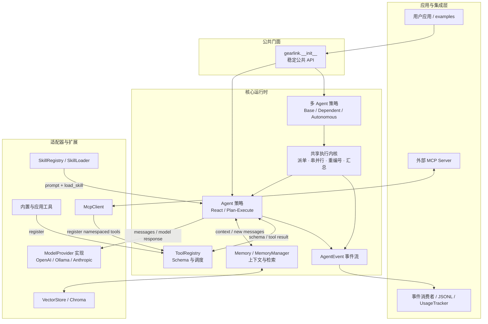
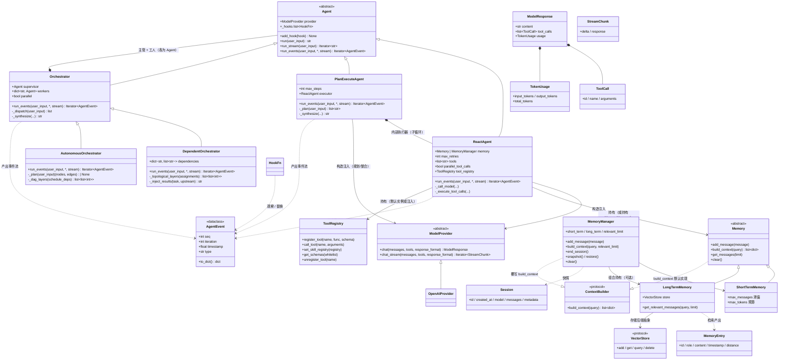
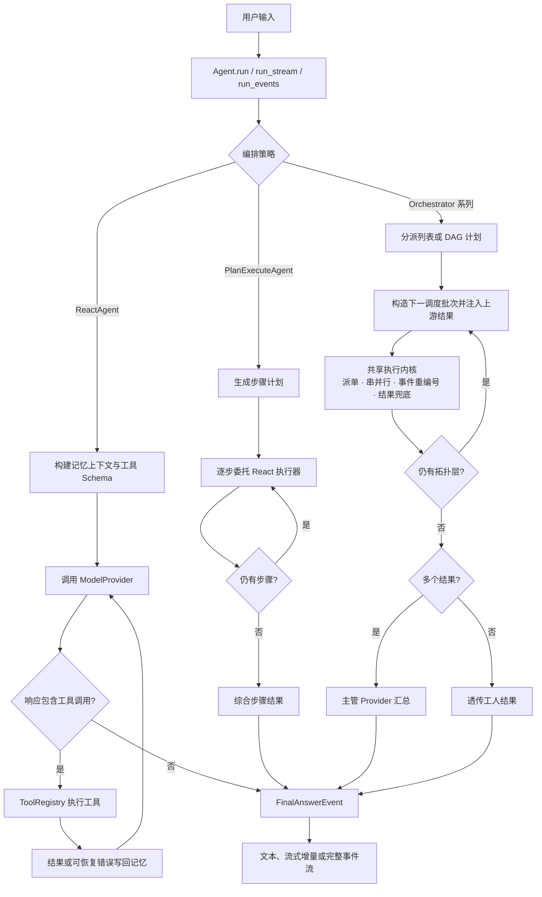
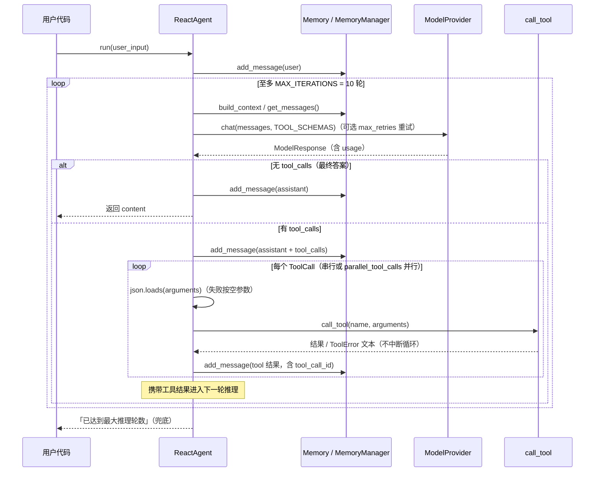
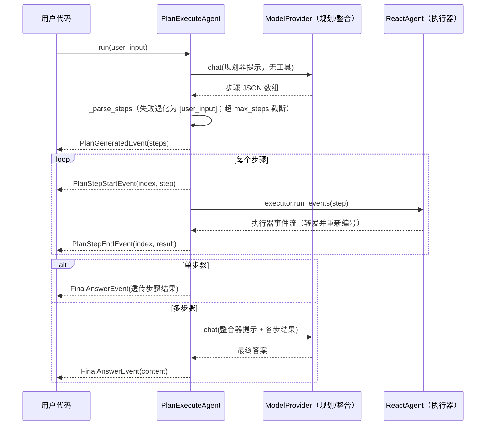
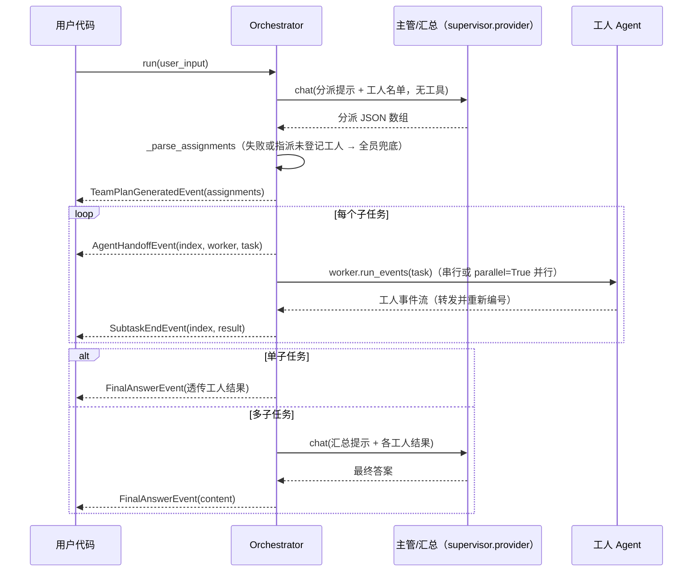
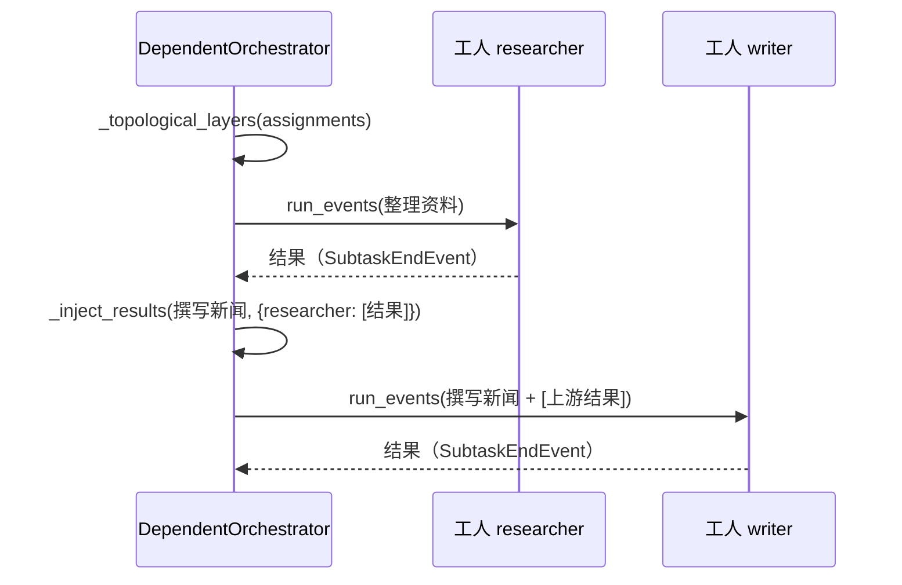
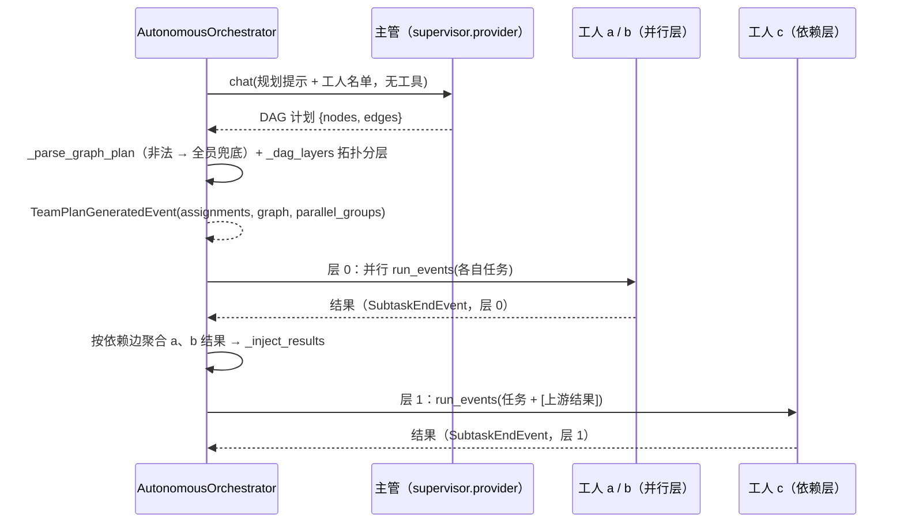
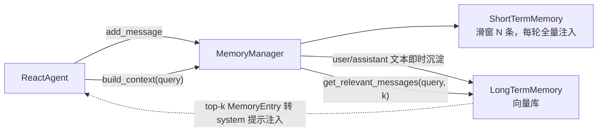

# GearLink 架构设计

> 本文档描述 GearLink 的整体架构：分层结构、核心组件职责、运行时数据流与四类扩展点的契约。
> 内容与 `gearlink/` 包当前代码严格对齐，并假定 M0 / M1 / M2 三大里程碑（工程化、可插拔深化、生产可用）均已落地。

## 1. 设计目标

1. **轻量**：一个 ReAct 循环编排器 + 三个可插拔维度（模型、记忆、工具），不引入重型框架。
2. **可插拔**：模型服务、记忆实现、工具集、技能包均可替换，核心层只面向抽象编程（依赖倒置）。
3. **可观测、可恢复、可演进**：以事件流作为运行时唯一事实来源，支持落盘回放与用量统计；会话可快照恢复；扩展点均为「纯新增 + 可选参数」，默认值等价历史行为。

约束（沿用既有规范）：

- `core/` 只依赖抽象，不得 import `providers/`、`tools/`、`mcp/` 的具体实现（`docs/开发规范.md` §1）。`core/` 对 `providers/base.py` 的 `ModelProvider` / `ModelResponse` / `StreamChunk` / `TokenUsage` / `ToolCall` 以及 `skills/base.py` 的 `Skill` / `SkillRegistry` 契约类型的依赖，属于对抽象的依赖，不视为反向依赖。
- 跨模块数据一律使用本项目 dataclass，第三方 SDK 类型不得穿透 API 边界（`docs/开发规范.md` §5.1）。
- 扩展点遵循「注册表 + schema + 调度器」三件套（`docs/开发规范.md` §6）。

## 2. 分层架构



实线箭头同时表示运行时数据流和调用方向；双向箭头表示请求/结果往返。扩展实现通过
构造函数或注册表注入。`core/` 只依赖 `ModelProvider`、`Memory`、`VectorStore` 等
抽象契约，不导入 Provider、MCP 或具体工具实现。可执行演示代码放在 `examples/`，
不得内嵌于核心模块。

## 3. 核心组件与类图



### 3.1 组件职责

| 组件 | 位置 | 职责 | 不负责 |
|---|---|---|---|
| `Agent` | `core/agent.py` | 编排策略抽象（ABC）：统一对外调用契约——`run_events` 为循环唯一实现（子类必须提供）、`run` / `run_stream` 为事件流消费者（基类实现）、`add_hook` 注册事件回调、`_emit` 分配 `seq`/`timestamp` 并施加回调 | 不实现具体编排循环（由子类提供） |
| `ReactAgent` | `core/agent.py` | 编排 Reason→Act→Observe 循环；管理轮数上限 `MAX_ITERATIONS`；工具失败作为可恢复信号写回记忆；支持构造注入 `Memory` 或 `MemoryManager`；支持 `max_retries` 指数退避重试、`tools` 白名单、`parallel_tool_calls` 并行工具、`skill_registry` 技能注入 | 不感知具体模型 SDK、不实现具体工具 |
| `PlanExecuteAgent` | `core/agent.py` | 规划-执行策略：规划器（纯 LLM，无工具）分解任务为步骤清单 → 每步运行内部 `ReactAgent` 执行器子循环（复用工具/记忆/技能）→ 多步骤经整合器生成最终答案，单步骤透传；规划解析失败退化为单步骤；步骤数超 `max_steps` 截断 | 不重复实现 ReAct 循环（复用 `ReactAgent`） |
| `Orchestrator` | `core/orchestrator.py` | 多 Agent 协作编排（主管-工人）；同时提供共享执行模板：`_execute_batch` 统一派单、串并行执行、事件重编号、终态提取与兜底，`_finalize_results` 统一单结果透传和多结果汇总。分派解析失败时退化为全员兜底 | 不重复实现 ReAct 循环；不定义依赖图语义 |
| `DependentOrchestrator` | `core/orchestrator.py` | 静态依赖策略：构造时声明 worker 依赖，做 Kahn 拓扑分层，并把 `[上游结果]` 注入下游任务；每层委托基类执行模板 | 不重复实现工人执行、事件转发或最终汇总 |
| `AutonomousOrchestrator` | `core/orchestrator.py` | 动态依赖策略：主管生成并校验 DAG，增加同工人串行约束，按节点依赖注入上游结果；计划非法时降级为全员单层分派；每层委托基类执行模板 | 不重复实现工人执行、事件转发或最终汇总 |
| `AgentEvent` 体系 | `core/events.py` | 运行时中间事件的单一事实来源：`AgentEvent` 基类 + 15 个子类事件；`JsonlEventSink` / `jsonl_hook` / `load_jsonl_events` 落盘与回放；`HookFn` 回调类型 | 不承载编排逻辑 |
| `ModelProvider` | `providers/base.py` | 定义唯一的模型调用契约 `chat()`（以及默认回退非流式的 `chat_stream()`）；统一响应结构 `ModelResponse` / `ToolCall` / `StreamChunk` / `TokenUsage` | — |
| `OpenAIProvider` | `providers/openai_provider.py` | 适配 OpenAI 兼容接口（OpenAI / DeepSeek / 国产兼容 base_url）；第三方异常包装为 `ProviderError`（瞬时故障标记 `retryable`）；透传 `response_format` 与 `usage`；实现真流式 `chat_stream` | 不决定消息内容组织（由 Agent 负责） |
| `OllamaProvider` | `providers/ollama_provider.py` | 本地 Ollama：继承 `OpenAIProvider` 复用 `/v1` 兼容端点，无需密钥 | 同上 |
| `AnthropicProvider` | `providers/anthropic_provider.py` | 适配 Anthropic Messages API：请求侧 OpenAI 格式 → system 提取 / tool_use / tool_result 转换，响应侧 text / tool_use 块归一化为 `ModelResponse`；依赖可选（懒加载，`gearlink[anthropic]`） | 同上 |
| `Memory` 体系 | `core/memory.py` | 短期：滑窗消息队列 + token 预算；长期：向量语义检索（可注入 `embedding_function`，后端收敛为 `VectorStore` 协议）；`Memory` 基类提供 `build_context` 默认实现（`ContextBuilder` 协议），`MemoryManager` 覆写为检索注入 + 预算裁剪 | 不决定何时写入（由 Agent / MemoryManager 决定） |
| `MemoryManager` | `core/memory.py` | 组合短期/长期记忆：写入短期 + 选择性沉淀长期；`build_context` 组装请求消息（检索注入 + 预算裁剪）；`end_session` 会话结束沉淀摘要/画像；`snapshot`/`restore` 会话持久化 | 不是 `Memory` 子类，不对齐三方法抽象；是面向「短期+长期」场景的组合器 |
| 工具三件套 | `core/tool.py` | `ToolRegistry` 可实例化注册表（`register_tool` / `call_tool` / `set_skill_registry` / `get_schemas` / `unregister_tool`）+ 模块级默认实例（`TOOL_REGISTRY` / `TOOL_SCHEMAS` / `register_tool` / `call_tool` 委托，向后兼容）；`build_tool_schema` 自动生成 schema；工具执行期间经 `contextvars` 暴露当前注册表 | 不承载具体工具实现（具体实现在 `tools/`） |
| `exceptions` | `gearlink/exceptions.py` | 统一异常层次；公共 API 只抛 `GearLinkError` 体系 | — |

## 4. 运行时数据流

### 核心业务逻辑总览



所有路径最终收敛到 `FinalAnswerEvent`；达到迭代上限时以 `LoopAbortEvent` 表示终止。
`run` 与 `run_stream` 只是事件流消费者，业务循环只在 `run_events` 中实现。

### 4.1 ReAct 循环（`ReactAgent`）

与 `ReactAgent.run_events()` 现状一一对应（`run()` / `run_stream()` 是其事件流消费者）：



**关键设计决策**：

- **工具失败是可恢复信号**：`GearLinkError`（含 `ToolError` / `SkillError` 等）被捕获后以文本写回 `role=tool` 消息，交给模型自行处理，不中断循环。
- **消息格式即 OpenAI 标准**：`role / content / tool_calls / tool_call_id`，不做项目自创封装，降低 Provider 实现成本。
- **无隐式状态**：所有上下文都在 `Memory` 中，Agent 每轮从记忆重建请求。
- **记忆可注入**：`ReactAgent(provider, memory=None)`，默认短期记忆 + 内置系统提示；注入 `MemoryManager` 时首轮通过 `build_context(query)` 注入长期记忆检索结果，后续轮次默认不再注入；开启 `retrieve_every_iteration=True` 可每轮注入。
- **重试边界**：仅对 `retryable=True` 的 `ProviderError`（网络/限流/服务端 5xx）按指数退避重试，鉴权等确定性错误直接抛出；已产出文本增量的流式调用不重试（避免重复输出）。

### 4.2 规划-执行（`PlanExecuteAgent`）



**执行流程分阶段说明：**

1. **规划阶段（Plan）**：`_plan(user_input)` 用 `self.provider` 发起一次「纯 LLM、无工具」的规划调用，提示词要求模型把任务拆分为有序步骤 JSON 数组（`list[str]`）。返回后经 `_parse_steps` 解析：若输出无法解析为步骤数组，则退化为 `[user_input]` 单步骤（等价于直接执行原任务）；若步骤数超过 `max_steps`（默认 5），按序截断。规划结果以 `PlanGeneratedEvent(steps)` 产出。

2. **执行阶段（Execute）**：对每个步骤，先产出 `PlanStepStartEvent(index, step)`，再调用内部执行器 `self.executor.run_events(step)` 完整走一遍 ReAct 子循环（复用工具、记忆、技能与模型重试）。执行器产出的事件经 `_forward_event` 转发给父级事件流——父级统一重新分配 `seq` 与 `timestamp`（保持全局唯一单调），子循环内的 `FinalAnswerEvent` 被吞掉、替换为该步的 `PlanStepEndEvent(index, result)`。

3. **整合阶段（Synthesize）**：只有单步骤时直接把该步结果作为最终答案（不再二次调用模型）；多步骤时 `_synthesize` 用 `self.provider` 发起第二次「纯 LLM」整合调用，把各步骤结果拼入提示词生成最终答案，`stream=True` 时整合文本以 `TextDeltaEvent` 增量产出。最终统一以 `FinalAnswerEvent` 收敛。

4. **异常与边界**：规划器 / 整合器 / 执行器共享同一个 `provider`；工具失败等可恢复信号在执行器子循环内部消化，不会中断整体规划流程。

### 4.3 多 Agent 协作（`Orchestrator`）



**执行流程分阶段说明：**

1. **分派阶段（Dispatch）**：`_dispatch(user_input)` 用 `self.supervisor.provider` 发起「纯 LLM、无工具」的分派调用，提示词携带工人名单，要求模型输出 `[{"worker": ..., "task": ...}]` 形式的子任务清单。解析失败、或指派的工人名不在 `workers` 中时，退化为「把原任务派给全部工人」的兜底策略。分派结果以 `TeamPlanGeneratedEvent(assignments)` 产出。

2. **执行阶段（Execute）**：对每个子任务，先产出 `AgentHandoffEvent(index, worker, task)` 表示派单，再调用对应工人 `workers[worker].run_events(task)`。串行模式下逐个执行；`parallel=True` 时通过线程池并发执行（要求工人线程安全），但事件仍按「派单 → 工人 → 汇总」的提交顺序产出。工人事件经父级转发并重新分配 `seq` / `timestamp`，工人自身的 `FinalAnswerEvent` 被替换为该子任务的 `SubtaskEndEvent(index, result)`。

3. **整合阶段（Synthesize）**：单个子任务直接透传其结果；多个子任务时 `_synthesize` 用主管 provider 发起汇总调用，把各工人结果拼入提示词生成最终答案，`stream=True` 时汇总文本以 `TextDeltaEvent` 增量产出。最终以 `FinalAnswerEvent` 收敛。

4. **与 `PlanExecuteAgent` 的差异**：两者都走「规划 → 执行 → 整合」三段式，但 `PlanExecuteAgent` 是单模型串行步骤（一个 provider、一个执行器、步骤间无角色分工），`Orchestrator` 是多 Agent 协作（主管 + 多名工人，工人各自独立 provider / memory / tools / skills），适合跨角色、可并行的任务拆分。

### 4.4 依赖编排（`DependentOrchestrator`）

`DependentOrchestrator` 是 `Orchestrator` 的纯新增子类（现有 `Orchestrator` 行为不变），
补充「工人间依赖」的流水线协作能力，解决「上游工人整理资料 → 下游工人基于资料撰写」
这类任务在星型拓扑下无法传递中间结果的问题。

**与 `Orchestrator` 的差异：**

1. **依赖声明（构造时）**：`dependencies` 记录 worker 名 → 其依赖的上游 worker 名列表；
   `None` 时行为与 `Orchestrator` 完全一致。构造时校验引用未登记工人与依赖图循环（抛 `GearLinkError`）。
2. **调度阶段（Execute）**：`_topological_layers` 把分派清单按 worker 级依赖做 Kahn 拓扑分层；
   层内任务互不依赖（`parallel=True` 时层内线程池并行），层间必须串行；
   事件产出顺序仍按分派清单确定性排序、`seq` 全局递增。
3. **结果注入（Inject）**：下游任务执行前，`_inject_results` 把上游工人结果拼成
   `[上游结果]` 报告段落追加到任务文本；`AgentHandoffEvent.task` 为注入后的文本；
   同一上游工人多个任务时全部列出；依赖的上游工人本次未被分派时该依赖静默忽略。
4. **韧性语义**：上游未收敛（兜底文案）/ 循环中止（`reason`）仍作为结果注入，下游照常执行。

时序（依赖段）：



### 4.5 模型自主编排（`AutonomousOrchestrator`）

`AutonomousOrchestrator` 是 `Orchestrator` 的纯新增子类（现有 `Orchestrator` /
`DependentOrchestrator` 行为不变），把「依赖编排」从构造时的静态声明升级为主管模型
按任务内容的**每次请求自主决策**：主管自主决定子任务拆分、工人指派与串/并行策略，
串行与并行可混合（无依赖子任务并行、有依赖子任务按先后顺序执行）。

**DAG 内部模型与计划格式：** 主管经一次纯 LLM 调用（`response_format={"type": "json_object"}`）
产出有向无环图计划，节点为子任务/工人、边为数据依赖与消息传递关系：

```json
{
  "nodes": [{"id": "节点ID", "worker": "工人名", "task": "子任务指令"}],
  "edges": [{"from": "上游节点ID", "to": "下游节点ID"}]
}
```

兼容主管输出旧分派格式（纯 JSON 数组）：按数组顺序解释为串行链。`_parse_graph_plan`
统一校验：节点非空、id 唯一、worker/task 非空且工人均已登记、边引用存在的节点、
无自环、图无环（节点级依赖映射复用 `_detect_dependency_cycle`）。

**调度算法（Kahn 拓扑分层）：** 合法计划展平为与现有契约一致的 `assignments`
（`{"worker", "task"}` 列表），按节点级依赖做 Kahn 拓扑分层（`_dag_layers`）：
层内互不依赖（`parallel=True`，默认，时层内线程池并行），层间严格串行；
同一工人被派多个节点时隐式追加链式边（前→后）保证执行序确定。
事件产出顺序仍按分层与分派序确定性排序、`seq` 全局递增。

**并行任务消息同步：** 层屏障保证下游节点开始前其全部直接上游已完成；每层执行前按
依赖边汇总每个节点的**全部直接上游**结果，按上游工人名分组后经 `_inject_results`
以 `[上游结果]` 报告段落注入任务文本（`AgentHandoffEvent.task` 为注入后文本，
`upstream` 字段标注同步来源下标）；上游未收敛时兜底文案照注入、不中断编排。

**错误处理与兜底：** 计划解析失败、引用未登记工人、边引用缺失节点或出现环时，
记录 warning 日志并降级为现有兜底策略（把原任务派给全部工人，单层无依赖执行），
此时事件不携带 `graph` / `parallel_groups` / `layer` / `upstream` 字段。

**与现有主管-工人模式的关系：**

| 维度 | `Orchestrator` | `DependentOrchestrator` | `AutonomousOrchestrator` |
| --- | --- | --- | --- |
| 依赖来源 | 无 | 用户构造时静态声明（worker 级） | 主管模型每次请求自主生成（节点级 DAG） |
| 执行策略 | 全串行 / 全并行二选一 | 拓扑分层（层内可并行） | 拓扑分层（层内可并行，默认开启） |
| 结果传递 | 无（仅汇总） | 上游结果注入下游任务 | 按依赖边聚合直接上游结果注入下游任务 |
| 计划非法时 | 全员兜底分派 | 构造时抛 `GearLinkError` | 记录日志并降级全员兜底分派 |

时序（自主编排）：



## 5. 事件流契约

所有 Agent 实现共享同一事件流契约（`core/events.py`）：

- **`run_events(user_input, *, stream)` 是编排循环的唯一实现**，逐步产出 `AgentEvent` 子类事件。通用事件：`StepStartEvent` / `TextDeltaEvent`（stream 时） / `ModelMessageEvent` / `ToolCallStartEvent` / `ToolCallEndEvent` / `FinalAnswerEvent` / `LoopAbortEvent`。
- **`run` / `run_stream` 是事件流消费者**（基类统一实现）：`run` 收敛 `FinalAnswerEvent` 返回最终答案（未收敛返回兜底文案）；`run_stream` 只转发 `TextDeltaEvent` 文本增量（循环中止时产出兜底文案）。
- **事件回调（on_step 语义）**：经构造参数 `hooks` 或 `add_hook` 注入 `HookFn`，每个事件经 `_emit` 产出时按序调用，可返回替换事件（None 表示不修改）；事件 `seq` 全局递增（子循环事件经父级转发重新编号），`timestamp` 由 `_emit` 登记。
- **`PlanExecuteAgent` 额外事件**：`PlanGeneratedEvent`（步骤清单）→ 每步 `PlanStepStartEvent` → 执行器子循环事件 → `PlanStepEndEvent`（携带该步结果）；多步骤且 stream=True 时整合文本以 `TextDeltaEvent` 产出。
- **`Orchestrator` 额外事件**：`TeamPlanGeneratedEvent`（主管分派清单；`DependentOrchestrator` 额外携带 `dependencies` 字段；`AutonomousOrchestrator` 额外携带 `graph`（DAG 计划）/ `parallel_groups`（拓扑分层）字段）→ 每个子任务 `AgentHandoffEvent`（派单，依赖/自主编排时 `task` 为注入后文本；自主编排额外携带 `layer` / `upstream` 字段）→ 工人事件（转发并重新编号）→ `SubtaskEndEvent`（自主编排额外携带 `layer` 字段）；多子任务且 stream=True 时汇总文本以 `TextDeltaEvent` 产出。
- **可观测性**：`ModelMessageEvent` 携带 `usage: TokenUsage | None`（由提供者透传）；`JsonlEventSink` / `jsonl_hook` 把事件逐条落盘为 JSONL（含 `seq` / `timestamp`），`load_jsonl_events` 离线回放。

## 6. 扩展点契约（四类）

均遵循「注册表 + schema + 调度器」三件套，第三方扩展只新增文件并注册，不修改 `core/`。

### 6.1 Provider（模型）

继承 `ModelProvider`，实现 `chat()`（可选覆写 `chat_stream()` 获得真流式），返回统一 `ModelResponse`。新增一家服务 = 新增一个文件，在 `providers/__init__.py` 与顶层 `__init__.py` 导出。已落地：`OpenAIProvider`（OpenAI 兼容，含国产模型 base_url 用法）、`OllamaProvider`（本地，无需密钥）、`AnthropicProvider`（Messages API 双向归一化，依赖可选 `gearlink[anthropic]`）。

### 6.2 Tool（工具）

普通函数 + JSON Schema，显式登记进 `ToolRegistry`（模块级默认实例经 `TOOL_REGISTRY` / `TOOL_SCHEMAS` 暴露，向后兼容）：

- `ToolRegistry` 类（架构治理 §6.4）：可实例化注册表，经 `ReactAgent(tool_registry=...)` / `PlanExecuteAgent(tool_registry=...)` / `McpClient(tool_registry=...)` 注入实现工具/技能集隔离；未注入时使用模块级默认实例，行为与升级前一致。
- `register_tool(name, func, schema)`：显式注册（禁止运行时隐式扫描），schema 须含 `description` 与 `parameters` 键，且与函数签名同源；工具名重复抛 `ToolError`。实例化路径用 `ToolRegistry.register_tool`。
- `build_tool_schema(func, description=None)`：从函数签名 + docstring 自动推导 JSON Schema（辅助路径，不替代手写）。
- `call_tool(name, arguments)`：集中调度器，未知工具抛 `ToolNotFoundError`，执行异常包装为 `ToolError`（保留 `__cause__`）。实例化路径用 `ToolRegistry.call_tool`，执行期间经 `contextvars` 暴露当前注册表。
- 具体工具实现位于 `tools/`（`builtin.py` 的 `get_current_time`、`load_skill.py` 的 `load_skill`），经 `register_tool` 登记。

### 6.3 Skill（技能）

定位：**Skill = 一份渐进式披露的专业知识包**，与 Agent 解耦，同样是「注册表 + 加载器 + 调度入口」模式：

- **数据契约 `Skill`**（`skills/base.py`）：L1 元数据（`name` / `description` / `metadata`）+ 按需加载的 L2 完整指令（`instructions`）；name 仅允许字母、数字与连字符，非法时抛 `SkillValidationError`。
- **注册表 `SkillRegistry`**：显式注册（同名警告并覆盖）、`get` 未命中抛 `SkillNotFoundError`、`list_all` / `contains` 查询。
- **加载器 `SkillLoader`**：`discover_from_directory` 扫描技能目录（每个子目录一个 `SKILL.md`，YAML frontmatter 必含 `name` / `description`，单个解析失败仅警告跳过）；`load_full_instructions` 加载 L2 正文。
- **调度入口 `load_skill` 工具**（`tools/load_skill.py`）：按名加载 L2 指令，注册表未注入或技能不存在时抛 `ToolError`，由 `call_tool` 统一兜底（可恢复信号）。

应用方式（装配期扩展，不改变 `ReactAgent.run()` 的循环逻辑）：

```python
from gearlink.skills import SkillLoader, SkillRegistry
import gearlink.tools.load_skill  # noqa: F401  # 显式导入，触发 load_skill 工具注册

registry = SkillRegistry()
for skill in SkillLoader.discover_from_directory(Path("examples/skill_demo")):
    registry.register(skill)

agent = ReactAgent(provider=provider, skill_registry=registry)  # 可选参数，默认等价不注入
```

注入 `skill_registry` 后：Agent 经 `core.tool.set_skill_registry` 登记注册表（供 `load_skill` 解析）；使用默认记忆时把可用技能列表（L1）拼入系统提示，模型按需调用 `load_skill` 获取完整指令并严格遵循。自行注入 `memory` 时系统提示由调用方自行组装。

### 6.4 Memory（记忆）

继承 `Memory`，实现 `add_message / get_messages / clear` 三方法（`build_context` 有默认实现返回 `get_messages()`，需要检索注入时覆写，即实现 `ContextBuilder` 协议，架构治理 §6.4）。`LongTermMemory` 额外提供 `get_relevant_messages()` 语义检索，其存储后端收敛为 `VectorStore` 协议（默认 `ChromaVectorStore` 包装 chromadb，行为不变；实现协议即可注入内存/文件/远程向量库等自定义后端）。`MemoryManager` 是组合器而非 `Memory` 子类（不对齐三方法签名，见 §7），适用于需要同时使用短期与长期记忆的场景。

## 7. 记忆架构（`MemoryManager`）

`MemoryManager` 组合短期与长期记忆——短期管「当下对话」，长期管「沉淀知识」：



核心接口（`core/memory.py`）：

```python
class MemoryManager:
    def __init__(
        self,
        short_term: Memory,
        long_term: LongTermMemory | None = None,
        relevant_limit: int = 5,
        max_context_tokens: int | None = None,
        summarizer: Callable[[str], str] | None = None,
        system_budget_ratio: float = 1.0,
        compress_context: bool = False,
        profile_hook: ProfileHookFn | None = None,
    ) -> None: ...

    def add_message(self, message: dict[str, Any]) -> None: ...
    def build_context(
        self, query: str, relevant_limit: int | None = None
    ) -> list[dict[str, Any]]: ...
    def end_session(self) -> None: ...
    def clear(self) -> None: ...
    def snapshot(
        self, model: str | None = None, metadata: dict | None = None
    ) -> dict[str, Any]: ...
    def restore(self, snapshot: dict[str, Any]) -> Session: ...
```

行为要点：

- `add_message`：必进短期记忆；`user/assistant` 且含非空 `content` 的文本消息即时沉淀进长期记忆（`system/tool` 消息不沉淀，避免噪声）。
- `build_context`：组装本轮请求消息——长期记忆 top-k 检索结果以带说话人标签（`[用户]`/`[助手]`）的 system 消息注入头部（过滤与短期窗口内容重复的条目）+ 短期记忆全量；配置 `max_context_tokens` 时按「系统消息优先、长期检索固定占比、短期从最新保留」裁剪；配置 `system_budget_ratio` 时，检索注入之外的 system 消息再按比例配额裁剪（检索注入消息受 `RETRIEVAL_BUDGET_RATIO` 独立保护）。
- `end_session`：注入 `summarizer` 时先将短期 user/assistant 文本拼成 transcript 生成会话摘要（`[会话摘要]` 前缀，失败不中断）沉淀进长期记忆；再补沉淀剩余消息；注入 `profile_hook` 时更新用户画像（失败保持原画像）；最后清空短期记忆。
- `snapshot` / `restore`：导出短期记忆全量消息 + 元数据的会话快照，可 JSON 落盘后恢复；长期记忆本身已持久化，不参与快照。

`LongTermMemory` 可选能力（构造参数，默认关闭，等价纯向量检索现状）：

- `embedding_function`：注入自定义向量化函数（`EmbeddingFn = Callable[[list[str]], list[list[float]]]`），写入与检索统一走注入函数；
- `recency_weight`：检索排序引入时间衰减，`score = distance + recency_weight * age_ratio`；
- `max_entries`：容量上限，超出按时间戳淘汰最旧条目；
- `dedupe`：写入前按 content 的 sha256 哈希（metadata `content_hash`）查询去重；
- `relevance_threshold`：检索结果按 distance 阈值过滤低相关条目；
- `mmr_lambda`：检索结果经 MMR（最大边际相关）去冗余重排，相似度以字符二元组 Jaccard 近似，λ=1.0 退化纯相关度排序；
- `store`：直接注入 `VectorStore` 后端，优先于 `vector_db`；
- `get_relevant_messages` 返回前恒按 content 精确去重（保留相关度首个）。

`MemoryManager` 进阶能力（均默认关闭）：

- `compress_context`：与 `summarizer` / `max_context_tokens` 三者齐备时生效，短期记忆超出阈值时把最旧一段（保留最新 2 条）动态压缩为 `[上下文摘要]` system 消息写回头部；压缩失败不中断（静态裁剪兜底）；
- `profile_hook`：`Callable[[新消息列表, 当前画像], 新画像或 None]`，`end_session` 时调用，非 None 时更新画像，后续 `build_context` 以 `[用户画像]` system 消息首位注入。

## 8. 目录结构

`gearlink/` 包的实际结构（M0~M2 已全部落地）：

```
gearlink/
├── __init__.py              # 公共 API 唯一出口（__all__ 显式导出）
├── exceptions.py            # GearLinkError 体系
├── core/
│   ├── agent.py             # Agent 抽象 + ReactAgent / PlanExecuteAgent（§3 / §4）
│   ├── orchestrator.py      # Orchestrator 多 Agent 协作编排层（§4.3）
│   ├── events.py            # AgentEvent 事件体系 + JSONL 落盘/回放（§5）
│   ├── memory.py            # Memory / ShortTerm / LongTerm / MemoryManager / VectorStore 协议（§7）
│   └── tool.py              # 注册表 + schema + 调度器（具体工具在 tools/）
├── providers/
│   ├── base.py              # ModelProvider / ModelResponse / ToolCall / TokenUsage / StreamChunk
│   ├── openai_provider.py   # OpenAI 兼容实现
│   ├── ollama_provider.py   # 本地 Ollama（无需密钥）
│   └── anthropic_provider.py # Anthropic Messages API 适配（依赖可选）
├── mcp/
│   └── client.py            # McpClient：外部 MCP 工具映射进注册表（依赖可选）
├── tools/
│   ├── builtin.py           # get_current_time 等内置工具实现与注册
│   └── load_skill.py        # load_skill 工具：按名加载技能 L2 指令
├── skills/
│   └── base.py              # Skill / SkillRegistry / SkillLoader（§6.3）
└── utils/                   # 通用辅助与全局日志开关
    ├── logging.py           # enable_logging / disable_logging
    ├── token_count.py       # estimate_tokens / count_message_tokens
    └── usage.py             # UsageTracker / UsageRecord
```

## 9. 异常与容错策略

```
GearLinkError
├── ProviderError        # providers/ 抛出；retryable 标记瞬时故障，供 Agent 层
│                        # max_retries 指数退避重试决策（鉴权等不可重试错误直接上抛）
├── ToolError            # call_tool 抛出；Agent 层捕获 → 写回 tool 消息（可恢复）
│   └── ToolNotFoundError
├── MemoryError          # LongTermMemory / 快照恢复抛出；短期记忆为纯内存无此风险
└── SkillError           # 技能体系抛出（load_skill 工具解析失败、SKILL.md 校验失败等）
    ├── SkillNotFoundError      # 按名查找技能未命中
    ├── SkillLoadError          # SKILL.md 解析失败
    ├── SkillValidationError    # 元数据（YAML frontmatter）校验失败
    └── SkillExecutionError     # 执行技能辅助脚本时出错
```

分层原则：扩展层负责把第三方异常包装成对应 `GearLinkError`（保留 `__cause__`）；核心层只做业务性容错（工具失败写回），不做静默吞错。`SkillError` 体系由 `skills/` 与 `tools/load_skill.py` 抛出，经 `call_tool` 统一兜底为可恢复信号写回模型处理。

## 10. 全局日志开关

框架内部统一使用标准库 `logging`，所有模块日志器命名以 `gearlink` 为根（如 `gearlink.core.agent` / `gearlink.core.memory` / `gearlink.skills.base`），默认静默——不配置任何 handler，遵循库的静默原则，由应用层决定输出策略。

`gearlink/utils/logging.py`（经顶层包导出）提供一键开关：

- `enable_logging(level=logging.INFO)`：为 `gearlink` 命名空间配置 stderr 输出并设置级别。幂等，重复调用不重复添加 handler；开启后命名空间不再向应用根日志器传播（`propagate=False`），避免与应用自行配置的 `basicConfig` 重复打印；
- `disable_logging()`：移除开关添加的 handler，并把命名空间级别调至高于 `CRITICAL` 以屏蔽全部内部日志，恢复静默。幂等；不影响应用为其他命名空间配置的日志。

配套规则（`docs/开发规范.md` §2）：内部模块只声明 `logger = logging.getLogger(__name__)` 并调用 `logger.debug/info/warning`，**不得自行添加 handler 或调用 `basicConfig`**，输出策略统一交给全局开关（或应用层的根日志器配置）决定。

## 11. 序列化约定

需要持久化/落盘的 dataclass 一律提供 `to_dict()` / `from_dict()` 方法对，且保证往返一致（`from_dict(to_dict(x)) == x`，`docs/开发规范.md` §5.3）：

| 结构 | 位置 | 序列化要点 |
|---|---|---|
| `MemoryEntry` | `core/memory.py` | 长期记忆条目；`distance` 字段兼容旧数据缺省 |
| `Session` | `core/memory.py` | 会话快照；`model` / `messages` / `metadata` 字段兼容旧数据缺省 |
| `ToolCall` | `providers/base.py` | `id` / `name` / `arguments` 三字段；缺字段抛 `KeyError` |
| `TokenUsage` | `providers/base.py` | `input_tokens` / `output_tokens`；缺字段回退 0 |
| `ModelResponse` | `providers/base.py` | 嵌套序列化 `tool_calls` / `usage`；缺字段时容错 |
| `UsageRecord` | `utils/usage.py` | `input_tokens` / `output_tokens` / `calls`；`calls` 兼容缺省 |
| `AgentEvent` 及其子类 | `core/events.py` | 经 `asdict` 展开（含 `seq` / `timestamp`），供 JSONL 落盘与离线回放 |

约定：

- `to_dict` 产出纯 JSON 可序列化的字典（不嵌套 dataclass 实例）；
- `from_dict` 对新增字段保持向后兼容（`data.get` + 默认值），对必需字段缺失明确抛错；
- 往返一致性用例统一放在 `tests/`（如 `test_provider_base.py`）。

## 12. 可观测性

- **用量透传**：`ModelResponse.usage`（`TokenUsage`）由提供者透传，`ModelMessageEvent.usage` 暴露给事件消费方。
- **事件落盘回放**：`JsonlEventSink` 把事件流逐条序列化为 JSONL（每行含 `seq` / `timestamp`），`jsonl_hook(sink)` 生成可直接挂到 `hooks` 的落盘回调，`load_jsonl_events` 离线回放为字典列表。
- **用量聚合与成本估算**：`UsageTracker` 按标签聚合 `TokenUsage`（`UsageRecord`），`estimate_cost(prices)` 按「每千 token 单价」估算成本。

## 13. 文档体系与上手路径

文档地图（按阅读顺序）：

```
README.md（项目定位 + 最短上手路径）
    ↓
docs/README.md（文档中心：概览 → 设置 → 架构 → 数据模型 → API → 治理）
    ↓
docs/使用教程.md（新手完整教程：安装 → 基础 → 进阶）
    ↓
docs/架构设计.md（本文档：分层、组件、数据流、扩展点契约）
    ↓
docs/接口文档.md（每个公共 API 的参数、结果和异常）
    ↓
docs/开发规范.md / docs/开发方向.md（贡献规则 / 未交付路线图）
```

示例文件与四类扩展点的映射（`examples/`）：

| 示例 | 对应扩展点 / 能力 | 免密钥 |
|---|---|---|
| `custom_provider_demo.py` | Provider（继承 `ModelProvider`，`chat_stream` 默认回退） | 是 |
| `custom_memory_demo.py` | Memory（继承 `Memory` 三方法，`ReactAgent(memory=...)` 注入） | 是 |
| `custom_tool_demo.py` | Tool（`register_tool` + `call_tool` 调度与错误兜底） | 是 |
| `event_hooks_demo.py` | 事件流 + hooks（on_step 观察/替换） | 是 |
| `session_restore_demo.py` | 会话 `snapshot` / `restore` 断线恢复 | 是 |
| `observability_demo.py` | token 用量透传 + JSONL 落盘回放 + 成本估算 | 是 |
| `memory_advanced_demo.py` | 上下文摘要压缩 / 用户画像 / 检索阈值与 MMR / 自定义 VectorStore | 是 |
| `orchestrator_demo.py` | `Orchestrator` 主管-工人多 Agent 协作 | 是 |
| `memory_chatbot.py` | Memory 组合（短期 + 长期 + 会话摘要） | 否 |
| `streaming_demo.py` | 流式 + 工具组合 | 否 |
| `plan_execute_demo.py` | Agent 策略（规划-执行 + 规划事件） | 否 |
| `ollama_local_demo.py` | `OllamaProvider` 本地模型 | 否（需本地 Ollama） |
| `anthropic_demo.py` | `AnthropicProvider` 接入 Claude | 否 |
| `mcp_client_demo.py` | `McpClient` 消费外部 MCP 工具 | 否 |
| `skill_demo/` | Skill（`SKILL.md` 目录结构） | — |

约定：新增公共 API 时同步补齐「示例 + 测试 + docstring」三件套（`docs/开发规范.md` §9），并在上表与 `docs/使用教程.md` 的索引中登记对应示例。
