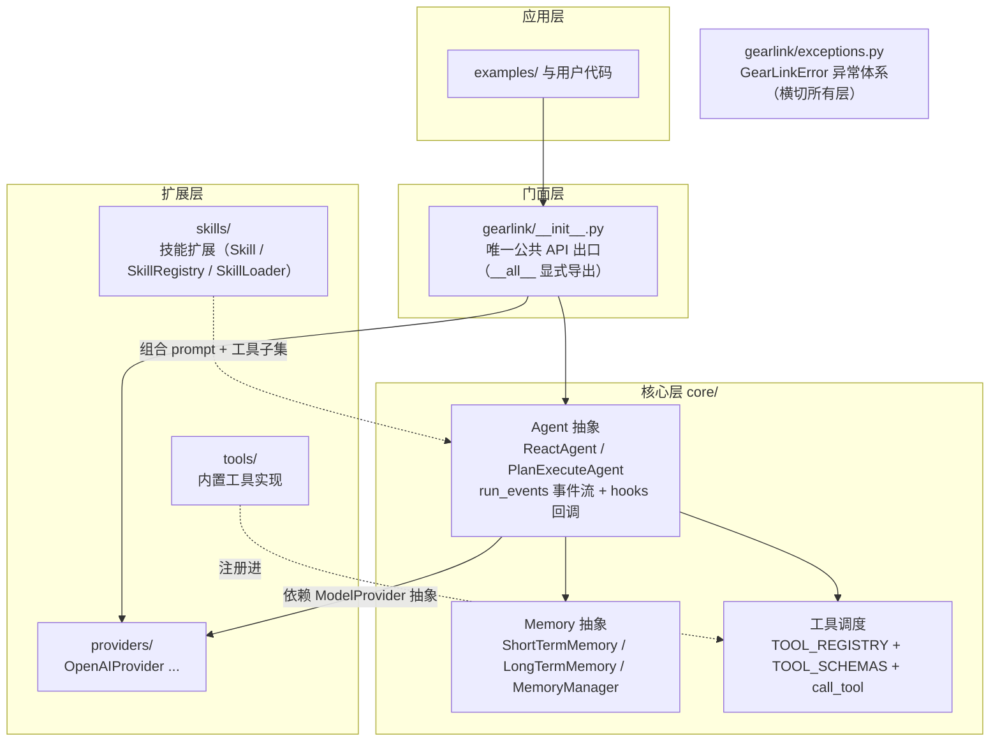
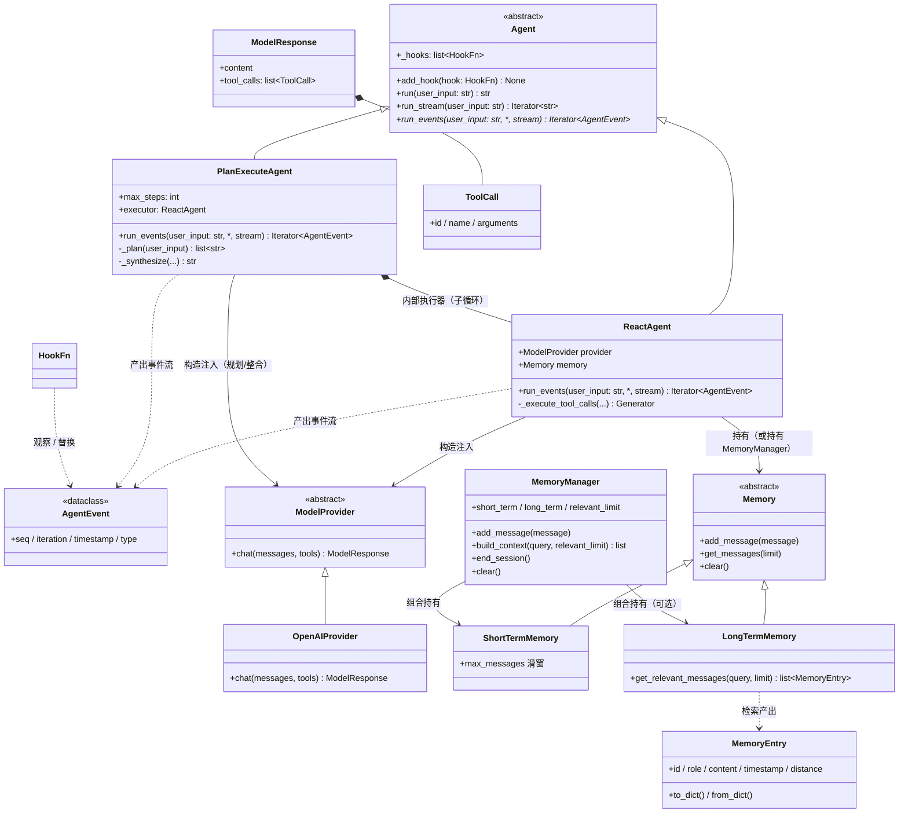
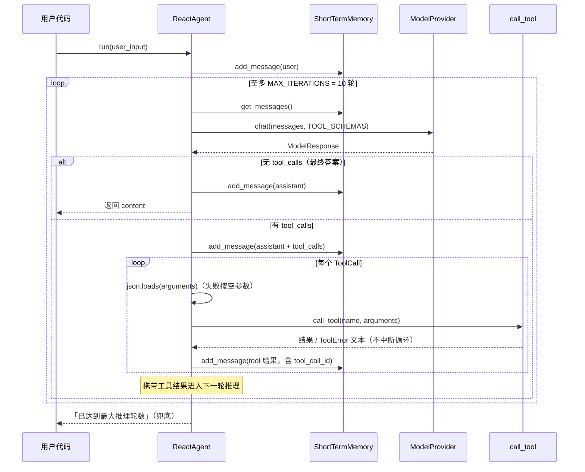
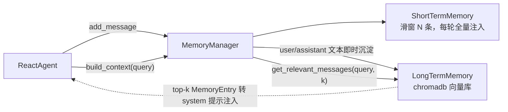

# GearLink 架构设计

> 本文档描述 GearLink 的整体架构：分层结构、核心组件职责、运行时数据流与四类扩展点的契约。
> 设计与当前代码（`gearlink/` 包）严格对齐，并为 `TODO.md` 中的待办项给出目标形态。

## 1. 设计目标

1. **轻量**：一个 ReAct 循环编排器 + 三个可插拔维度（模型、记忆、工具），不引入重型框架。
2. **可插拔**：模型服务、记忆实现、工具集均可替换，核心不感知具体实现（依赖倒置）。
3. **可演进**：当前代码即架构的第一阶段落地，`skills/`、`MemoryManager`、`tools/` 迁移等待办项均有明确的扩展位，无需推翻现有结构。

约束（沿用既有规范）：

- `core/` 只依赖抽象，不得 import `providers/`、`tools/`、`skills/` 的具体实现（`开发规范.md` §1）。
- 跨模块数据一律使用本项目 dataclass，第三方 SDK 类型不得穿透 API 边界（`接口设计规范.md` §1）。
- 扩展点遵循「注册表 + schema + 调度器」三件套（`接口设计规范.md` §4）。

## 2. 分层架构



**依赖方向铁律**：箭头只允许从外向内。扩展层实现核心层定义的抽象，通过构造函数注入（`ReactAgent(provider=OpenAIProvider())`）；核心层永远不反向 import 扩展层。唯一的例外是 `core/` 对 `skills/` 中 `Skill` / `SkillRegistry` 契约类型的依赖，属于对抽象的依赖（与依赖 `providers/base.py` 同理），不视为反向依赖。可直接运行的演示代码一律放在根目录 `examples/`，不得内嵌于 `core/` 源文件。

## 3. 核心组件与类图



### 3.1 组件职责

| 组件 | 位置 | 职责 | 不负责 |
|---|---|---|---|
| `Agent` | `core/agent.py` | 编排策略抽象（ABC）：统一对外调用契约——`run_events` 为循环唯一实现（子类必须提供）、`run` / `run_stream` 为事件流消费者（基类实现）、`add_hook` 注册事件回调 | 不实现具体编排循环（由子类提供） |
| `ReactAgent` | `core/agent.py` | 编排 Reason→Act→Observe 循环；管理轮数上限 `MAX_ITERATIONS`；工具失败作为可恢复信号写回记忆；支持构造注入 `Memory` 或 `MemoryManager`（`memory=None` 时默认 `ShortTermMemory(max_message=20)` + 内置 SYSTEM_PROMPT） | 不感知具体模型 SDK、不实现具体工具 |
| `PlanExecuteAgent` | `core/agent.py` | 规划-执行策略：规划器（纯 LLM，无工具）分解任务为步骤清单 → 每步运行内部 `ReactAgent` 执行器子循环（复用工具/记忆/技能）→ 多步骤经整合器生成最终答案，单步骤透传；规划解析失败退化为单步骤；步骤数超 `max_steps` 截断 | 不重复实现 ReAct 循环（复用 `ReactAgent`） |
| `ModelProvider` | `providers/base.py` | 定义唯一的模型调用契约 `chat()`；统一响应结构 `ModelResponse` / `ToolCall` | — |
| `OpenAIProvider` | `providers/openai_provider.py` | 适配 OpenAI 兼容接口（OpenAI / DeepSeek）；第三方异常包装为 `ProviderError` | 不决定消息内容组织（由 Agent 负责） |
| `Memory` 体系 | `core/memory.py` | 短期：滑窗消息队列；长期：chromadb 向量语义检索 | 不决定何时写入（由 Agent / MemoryManager 决定） |
| `MemoryManager` | `core/memory.py` | 组合短期/长期记忆：写入短期 + 选择性沉淀长期；`build_context` 组装请求消息；`end_session` 会话结束沉淀钩子 | 不是 `Memory` 子类，不对齐三方法抽象；是面向「短期+长期」场景的组合器 |
| 工具三件套 | `core/tool.py` | `TOOL_REGISTRY`（注册表）+ `TOOL_SCHEMAS`（JSON Schema）+ `call_tool`（调度器，集中错误兜底） | 不承载具体工具实现（目标态，见 §7） |
| `exceptions` | `gearlink/exceptions.py` | 统一异常层次；公共 API 只抛 `GearLinkError` 体系 | — |

## 4. 运行时流程（ReAct 循环）

与 `ReactAgent.run_events()` 现状一一对应（`run()` / `run_stream()` 是其事件流消费者）：



**关键设计决策**：

- **工具失败是可恢复信号**：`ToolError` 被捕获后以文本写回 `role=tool` 消息，交给模型自行处理，不中断循环（`接口设计规范.md` §5）。
- **消息格式即 OpenAI 标准**：`role / content / tool_calls / tool_call_id`，不做项目自创封装，降低 Provider 实现成本。
- **无隐式状态**：所有上下文都在 `Memory` 中，Agent 每轮从记忆重建请求。
- **记忆可注入**：`ReactAgent(provider, memory=None)`，默认短期记忆；注入 `MemoryManager` 时首轮通过 `build_context(query)` 注入长期记忆检索结果，后续轮次默认不再注入；开启 `retrieve_every_iteration=True` 可每轮注入（见 §6）。

### 4.1 事件流契约（Agent 抽象统一对外接口）

所有 Agent 实现共享同一事件流契约（`core/events.py`）：

- **`run_events(user_input, *, stream)` 是编排循环的唯一实现**，逐步产出 `AgentEvent` 子类事件：`StepStartEvent` / `TextDeltaEvent`（stream 时） / `ModelMessageEvent` / `ToolCallStartEvent` / `ToolCallEndEvent` / `FinalAnswerEvent` / `LoopAbortEvent`；
- **`run` / `run_stream` 是事件流消费者**（基类统一实现）：`run` 收敛 `FinalAnswerEvent` 返回最终答案（未收敛返回兜底文案）；`run_stream` 只转发 `TextDeltaEvent` 文本增量（循环中止时产出兜底文案）；
- **事件回调（on_step 语义）**：经构造参数 `hooks` 或 `add_hook` 注入 `HookFn`，每个事件经 `_emit` 产出时按序调用，可返回替换事件（None 表示不修改）；事件 `seq` 全局递增（子循环事件经父级转发重新编号），`timestamp` 由 `_emit` 登记；
- **`PlanExecuteAgent` 额外事件**：`PlanGeneratedEvent`（步骤清单）→ 每步 `PlanStepStartEvent` → 执行器子循环事件 → `PlanStepEndEvent`（携带该步结果）；多步骤且 stream=True 时整合文本以 `TextDeltaEvent` 产出。

## 5. 扩展点契约（四类）

均遵循「注册表 + schema + 调度器」三件套，第三方扩展只新增文件并注册，不修改 `core/`。

### 5.1 Provider（已落地）

继承 `ModelProvider`，实现 `chat()`，返回统一 `ModelResponse`。新增一家服务 = 新增一个文件（如 `providers/anthropic_provider.py`），在 `providers/__init__.py` 导出。

### 5.2 Tool（已落地，待迁移）

现状：普通函数 + 手写 JSON Schema，显式登记进 `TOOL_REGISTRY` / `TOOL_SCHEMAS`。
推荐补充一个显式注册函数（仍是显式声明，不做运行时扫描），供 `tools/` 目录使用：

```python
def register_tool(name: str, func: Callable[..., Any], schema: dict[str, Any]) -> None:
    """将一个工具函数与其 JSON Schema 一并登记。

    Args:
        name: 全局唯一工具名。
        func: 工具实现函数。
        schema: OpenAI tools 所需的 function schema（不含外层 type 包装）。

    Raises:
        ToolError: 工具名重复时抛出。
    """
```

### 5.3 Skill（已落地：渐进式披露）

定位：**Skill = 一份渐进式披露的专业知识包**，与 Agent 解耦，同样是「注册表 + 加载器 + 调度入口」模式：

- **数据契约 `Skill`**（`skills/base.py`）：L1 元数据（`name` / `description` / `metadata`）+ 按需加载的 L2 完整指令（`instructions`）；name 仅允许字母、数字与连字符，非法时抛 `SkillValidationError`。
- **注册表 `SkillRegistry`**：显式注册（同名警告并覆盖）、`get` 未命中抛 `SkillNotFoundError`、`list_all` / `contains` 查询。
- **加载器 `SkillLoader`**：`discover_from_directory` 扫描技能目录（每个子目录一个 `SKILL.md`，YAML frontmatter 必含 `name` / `description`，单个解析失败仅警告跳过）；`load_full_instructions` 加载 L2 正文。
- **调度入口 `load_skill` 工具**（`tools/load_skill.py`）：按名加载 L2 指令，注册表未注入或技能不存在时抛 `ToolError`，由 `call_tool` 统一兜底（可恢复信号）。

应用方式（装配期扩展，不改变 `ReactAgent.run()` 的循环逻辑）：

```python
from gearlink.skills import SkillLoader, SkillRegistry
import gearlink.tools.load_skill  # noqa: F401  # 显式导入，触发 load_skill 工具注册

registry = SkillRegistry()
for skill in SkillLoader.discover_from_directory(Path("examples/skill_demo")):
    registry.register(skill)

agent = ReactAgent(provider=provider, skill_registry=registry)  # 可选参数，默认等价不注入
```

注入 `skill_registry` 后：Agent 经 `core.tool.set_skill_registry` 登记注册表（供 `load_skill` 解析）；使用默认记忆时把可用技能列表（L1）拼入系统提示，模型按需调用 `load_skill` 获取完整指令并严格遵循。自行注入 `memory` 时系统提示由调用方自行组装。

### 5.4 Memory（已落地：短期/长期/组合器）

继承 `Memory`，实现 `add_message / get_messages / clear` 三方法。`LongTermMemory` 额外提供 `get_relevant_messages()` 语义检索。`MemoryManager` 是组合器而非 `Memory` 子类（不对齐三方法签名，见 §6），适用于需要同时使用短期与长期记忆的场景。

## 6. 记忆架构（MemoryManager 已落地）

`MemoryManager` 组合短期与长期记忆——短期管「当下对话」，长期管「沉淀知识」：



已实现的接口（`core/memory.py`）：

```python
class MemoryManager:
    """记忆管理器：组合短期与长期记忆，统一为 Agent 提供上下文"""

    def __init__(
        self,
        short_term: Memory,
        long_term: LongTermMemory | None = None,
        relevant_limit: int = 5,
        max_context_tokens: int | None = None,
        summarizer: Callable[[str], str] | None = None,
        system_budget_ratio: float = 1.0,
    ) -> None: ...

    def add_message(self, message: dict[str, Any]) -> None:
        """写入短期记忆；user/assistant 含非空 content 的文本消息即时沉淀到长期记忆，
        system/tool 消息不沉淀（避免噪声）。"""

    def build_context(self, query: str, relevant_limit: int | None = None) -> list[dict[str, Any]]:
        """组装本轮请求消息：长期记忆 top-k 检索结果以带说话人标签（[用户]/[助手]）的
        system 消息注入头部（过滤与短期窗口内容重复的条目）+ 短期记忆全量；
        配置 max_context_tokens 时按系统消息优先、长期检索固定占比、短期从最新保留裁剪；
        配置 system_budget_ratio 时，检索注入之外的 system 消息再按比例配额裁剪
        （检索注入消息受 RETRIEVAL_BUDGET_RATIO 独立保护）。"""

    def end_session(self) -> None:
        """会话结束钩子：注入 summarizer 时先将短期 user/assistant 文本拼成 transcript
        生成会话摘要（带 [会话摘要] 前缀，失败不中断会话结束）沉淀进长期记忆；
        再补沉淀剩余消息，最后清空短期记忆。"""

    def clear(self) -> None:
        """清空短期与长期记忆。"""
```

与 `ReactAgent` 的集成（§8 步骤 3/4 已落地）：`ReactAgent(provider, memory=None)`，`memory=None` 时默认 `ShortTermMemory(max_message=20)` + 内置 SYSTEM_PROMPT；传入 `MemoryManager` 时，`run()` 首轮以用户输入为 query 调用 `build_context` 注入长期记忆，后续轮次默认直接使用短期记忆全量；开启 `retrieve_every_iteration=True` 时每轮迭代都携带 query 注入检索（依赖短期窗口去重避免重复注入）。

`LongTermMemory` 可选能力（构造参数，默认关闭，等价纯向量检索现状）：

- `recency_weight`：检索排序引入时间衰减，按 `score = distance + recency_weight * age_ratio` 重排（age_ratio 为条目年龄相对 30 天归一化的 [0,1] 值）；
- `max_entries`：容量上限，写入超出时按时间戳淘汰最旧条目；
- `dedupe`：写入前按 content 的 sha256 哈希（metadata `content_hash`）查询去重，命中跳过；
- `get_relevant_messages` 返回前恒按 content 精确去重（保留相关度首个），避免重复内容重复注入上下文。

## 7. 目标目录结构（演进终态）

与现状的差异仅在注释标注处，其余均为现有文件：

```
gearlink/
├── __init__.py              # 公共 API 唯一出口
├── exceptions.py            # GearLinkError 体系
├── core/
│   ├── agent.py             # Agent 抽象 + ReactAgent / PlanExecuteAgent 编排策略（见 §3 / §8）
│   ├── memory.py            # Memory / ShortTerm / LongTerm / MemoryManager
│   └── tool.py              # 仅保留注册表 + schema + 调度器（移除具体工具）
├── providers/
│   ├── base.py              # ModelProvider / ModelResponse / ToolCall
│   └── openai_provider.py   # OpenAI 兼容实现
├── tools/
│   └── builtin.py           # ← get_current_time 等内置工具迁入此处并注册
├── skills/
│   └── base.py              # Skill / SkillRegistry / SkillLoader（§5.3 已落地）
└── utils/                   # 通用函数与全局日志开关（token 计数、enable_logging / disable_logging）
```

## 8. 兼容性演进路线

按 `TODO.md` 待办排序，每一步都不破坏既有公共 API（接口冻结原则，规范 §6）：

| 步骤 | 内容 | 兼容策略 |
|---|---|---|
| 1 | ✅`tools/` 迁移：`get_current_time` 移入 `tools/builtin.py`，`core/tool.py` 只留三件套 | `gearlink` 顶层继续导出 `TOOL_REGISTRY / TOOL_SCHEMAS / call_tool`，调用方无感 |
| 2 | 新增 `register_tool()` | 纯新增 API |
| 3 | ✅ `ReactAgent` 支持注入记忆：`ReactAgent(provider, memory=None)`，`memory=None` 时默认 `ShortTermMemory(max_message=20)` + 现 SYSTEM_PROMPT | 现有 `ReactAgent(provider=...)` 调用完全兼容 |
| 4 | ✅ 实现 `MemoryManager`（`add_message` / `build_context` / `end_session` / `clear`），可通过步骤 3 的注入点替换默认记忆 | 纯新增；`Memory` 抽象签名不变 |
| 5 | ✅`ShortTermMemory` 补齐 `max_tokens` 截断（`utils/` 启发式 token 计数） | 行为收紧但签名不变 |
| 6 | ✅ `skills/` 落地 §5.3 契约 | 纯新增扩展点 |
| 7 | ✅ `print` 日志替换为标准库 `logging` | 内部实现变更 |
| 8 | ✅ 记忆升级：`MemoryManager` 新增 `summarizer` / `system_budget_ratio`，`LongTermMemory` 新增 `recency_weight` / `max_entries` / `dedupe`，`ReactAgent` 新增 `retrieve_every_iteration` | 全部为可选构造参数，默认值等价现状，向后兼容 |
| 9 | ✅ Skill 落地 §5.3 渐进式披露契约；`ReactAgent` 新增 `skill_registry` 可选参数 | 纯新增扩展点与可选参数，默认值等价现状 |
| 10 | ✅ Agent 抽象与 `PlanExecuteAgent`：`Agent`（ABC）统一 `run_events` / `run` / `run_stream` / `add_hook` 契约；新增规划-执行策略（规划器 → 内部 `ReactAgent` 执行器子循环 → 整合器），新增 `PlanGeneratedEvent` / `PlanStepStartEvent` / `PlanStepEndEvent` 事件 | `ReactAgent` 公共接口不变，纯新增抽象基类与策略，`run` / `run_stream` 行为等价（重构为事件流消费者） |

## 9. 异常与容错策略

```
GearLinkError
├── ProviderError        # providers/ 抛出；Agent 层不捕获，由调用方决定重试
├── ToolError            # call_tool 抛出；Agent 层捕获 → 写回 tool 消息（可恢复）
│   └── ToolNotFoundError
└── MemoryError          # LongTermMemory 抛出；短期记忆为纯内存无此风险
```

分层原则：扩展层负责把第三方异常包装成对应 `GearLinkError`（保留 `__cause__`）；核心层只做业务性容错（工具失败写回），不做静默吞错。

## 10. 全局日志开关

框架内部统一使用标准库 `logging`，所有模块日志器命名以 `gearlink` 为根
（如 `gearlink.core.agent` / `gearlink.core.memory` / `gearlink.skills.base`），
默认静默——不配置任何 handler，遵循库的静默原则，由应用层决定输出策略。

`gearlink/utils/logging.py`（经顶层包导出）提供一键开关：

- `enable_logging(level=logging.INFO)`：为 `gearlink` 命名空间配置 stderr 输出并
  设置级别。幂等，重复调用不重复添加 handler；开启后命名空间不再向应用根日志器
  传播（`propagate=False`），日志统一经开关输出，避免与应用自行配置的 `basicConfig`
  重复打印；
- `disable_logging()`：移除开关添加的 handler，并把命名空间级别调至高于
  `CRITICAL` 以屏蔽全部内部日志，恢复静默。幂等；不影响应用为其他命名空间
  配置的日志。

配套规则（开发规范 §2）：内部模块只声明 `logger = logging.getLogger(__name__)`
并调用 `logger.debug/info/warning`，**不得自行添加 handler 或调用 `basicConfig`**，
输出策略统一交给全局开关（或应用层的根日志器配置）决定。
